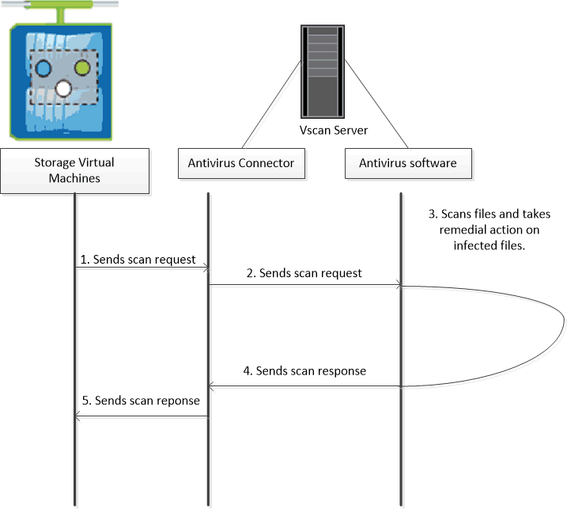

= About NetApp virus scanning
:icons: font
:imagesdir: ../media/

[.lead]
Vscan is an antivirus scanning solution developed by NetApp that allows customers to protect their data from being compromised by viruses or other malicious code. It combines partner-provided antivirus software with ONTAP features to give customers the flexibility they need to manage file scanning.

== How virus scanning works

Storage systems offload scanning operations to external servers hosting antivirus software from third-party vendors. 

Based on the active scanning mode, ONTAP  sends scan requests when clients access files over SMB (on-access) or access files in specific locations, on a schedule or immediately (on-demand).

* You can use _on-access scanning_ to check for viruses when clients open, read, rename, or close files over SMB. File operations are suspended until the external server reports the scan status of the file. If the file has already been scanned, ONTAP allows the file operation. Otherwise, it requests a scan from the server.
+
On-access scanning is not supported for NFS.
* You can use _on-demand scanning_ to check files for viruses immediately or on a schedule. We recommend that on-demand scans run only in off-peak hours to avoid overloading existing AV infrastructure, which is normally sized for on-access scanning. The external server updates the scan status of checked files, so that file-access latency is reduced over SMB. If there were file modifications or software version updates, it requests a new file scan from the external server.
+
You can use on-demand scanning for any path in the SVM namespace, even for volumes that are exported only through NFS.

You typically enable both on-access and on-demand scanning modes on an SVM. In either mode, the antivirus software takes remedial action on infected files based on your software settings.

The ONTAP Antivirus Connector, provided by NetApp and installed on the external server, handles communication between the storage system and the antivirus software.

// 2022-03-07, ontap-issues-387
// 2023 May 09, vscan-overview-update