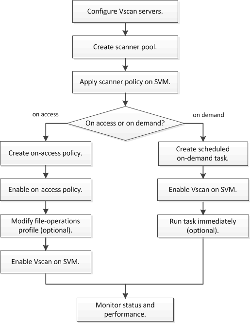

= Virus scanning workflow
:icons: font
:imagesdir: ../media/

[.lead]
You must create a scanner pool and apply a scanner policy before you can enable scanning. You typically enable both on-access and on-demand scanning modes on an SVM.

[NOTE]
You must have completed the CIFS configuration.

[NOTE]
To create an on-demand task, there must be at least one on-access policy enabled. It can be the default policy or a user created on-access policy.

// 05 July 2023, ONTAPDOC-790
// 2023 May 09, vscan-overview-update
