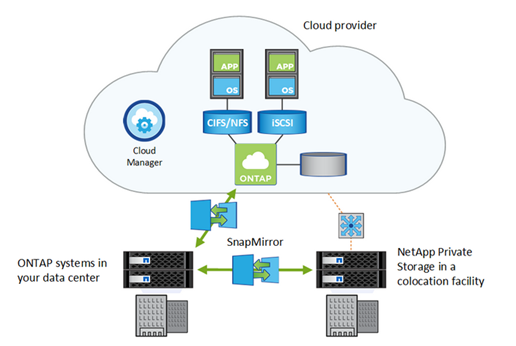

= Data replication
:icons: font
:imagesdir: ../media/

[.lead]
SnapMirror technology keeps your data synchronized between on-premises and cloud installations by using ONTAP Snapshot copies. SnapMirror performs block-level incremental data transfers to ensure that only the data that has changed is sent to your destination replica.

Similarly, you can use a SnapMirror vault relationship to create a data archive for the local Snapshot copies created on a Cloud Volumes ONTAP system.

NetApp Cloud Backup Service delivers seamless and cost-effective backup and restore capabilities for protecting and archiving data to object storage in the cloud. Cloud Backup Service is available for both cloud-based data and for on-premises data.

*Related information*

https://tv.netapp.com/detail/video/6056551157001/setup-a-disaster-recovery-copy-with-in-the-cloud-with-netapp-cloud-volumes-ontap?autoStart=true&page=1&q=ontap%20cloud[Setting up a disaster recovery in the cloud with Cloud Volumes ONTAP]

https://cloud.netapp.com/blog/simplified-disaster-recovery-ontap-cloud-snapmirror[Efficient Data Replication Using Cloud Volumes ONTAP and SnapMirror]

https://docs.netapp.com/us-en/ontap/data-protection/index.html[ONTAP Data Protection Power Guide]

https://cloud.netapp.com/cloud-backup-service[NetApp Cloud Backup Service]
