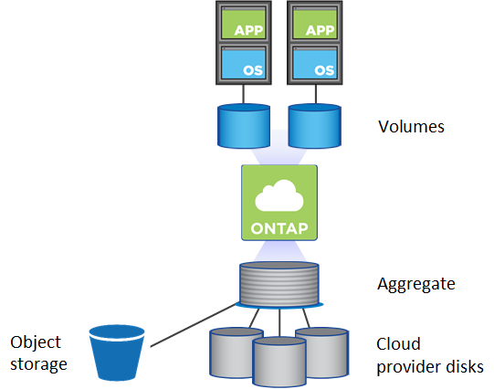

= Volume management
:icons: font
:imagesdir: ../media/

[.lead]
Flexible and efficient volume management is the heart of the ONTAP cloud solution. ONTAP FlexVol volumes offer the same data fabric benefits, with the same data management processes, regardless of whether they are configured on-prem in the cloud. You can also take advantage of cloud capabilities to rapidly scale workloads, increasing or decreasing capacity as needed.

Cloud volumes provide the same storage efficiencies as on-prem volumes: deduplication, compression, compaction, thin provisioning, and data tiering. In a cloud environment, this means that you pay less for underlying cloud disk usage.

There are two ways to provision volumes in the cloud:

* Create new cloud volumes.
* Replicate existing on-prem volumes to new cloud volume destination using SnapMirror technology or the Cloud Sync service.

.Related information

https://docs.netapp.com/us-en/occm/task_provisioning_storage.html[Cloud Manager: Provisioning storage]

https://docs.netapp.com/us-en/occm/task_manage_anf.html[Managing volumes for Azure NetApp Files]

https://docs.netapp.com/us-en/occm/task_manage_cvs_aws.html[Managing Cloud Volumes Service for AWS]

https://cloud.netapp.com/cloud-sync-service[Cloud Sync service]
