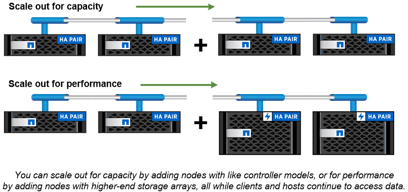

= Cluster storage
:icons: font
:imagesdir: ../media/

[.lead]
The current iteration of ONTAP was originally developed for NetApp's scale out _cluster_ storage architecture. This is the architecture you typically find in datacenter implementations of ONTAP. Because this implementation exercises most of ONTAP's capabilities, it's a good place to start in understanding the concepts that inform ONTAP technology.

Datacenter architectures usually deploy dedicated FAS or AFF controllers running ONTAP data management software. Each controller, its storage, its network connectivity, and the instance of ONTAP running on the controller is called a _node._

Nodes are paired for high availability (HA). Together these pairs (up to 12 nodes for SAN, up to 24 nodes for NAS) comprise the cluster. Nodes communicate with each other over a private, dedicated cluster interconnect.

Depending on the controller model, node storage consists of flash disks, capacity drives, or both. Network ports on the controller provide access to data. Physical storage and network connectivity resources are virtualized, visible to cluster administrators only, not to NAS clients or SAN hosts.

Nodes in an HA pair must use the same storage array model. Otherwise you can use any supported combination of controllers. You can scale out for capacity by adding nodes with like storage array models, or for performance by adding nodes with higher-end storage arrays.

Of course you can scale up in all the traditional ways as well, upgrading disks or controllers as needed. ONTAP's virtualized storage infrastructure makes it easy to move data nondisruptively, meaning that you can scale vertically or horizontally without downtime.

|===
a|
*_Single-node clusters_*

A single-node cluster is a special implementation of a cluster running on a standalone node. You might want to deploy a single-node cluster in a branch office, for example, assuming the workloads are small enough and that storage availability is not a critical concern.

In this scenario, the single-node cluster would use SnapMirror replication to back up the site's data to your organization's primary data center. ONTAP Select, with its support for ONTAP running on commodity hardware, would be a good candidate for this type of implementation.

|===

// 2023 Nov 09, Jira 1466
