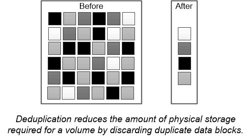

= Deduplication
:icons: font
:imagesdir: ../media/

[.lead]
_Deduplication_ reduces the amount of physical storage required for a volume (or all the volumes in an AFF aggregate) by discarding duplicate blocks and replacing them with references to a single shared block. Reads of deduplicated data typically incur no performance charge. Writes incur a negligible charge except on overloaded nodes.

As data is written during normal use, WAFL uses a batch process to create a catalog of _block signatures._ After deduplication starts, ONTAP compares the signatures in the catalog to identify duplicate blocks. If a match exists, a byte-by-byte comparison is done to verify that the candidate blocks have not changed since the catalog was created. Only if all the bytes match is the duplicate block discarded and its disk space reclaimed.

// 2023 Nov 09, Jira 1466
