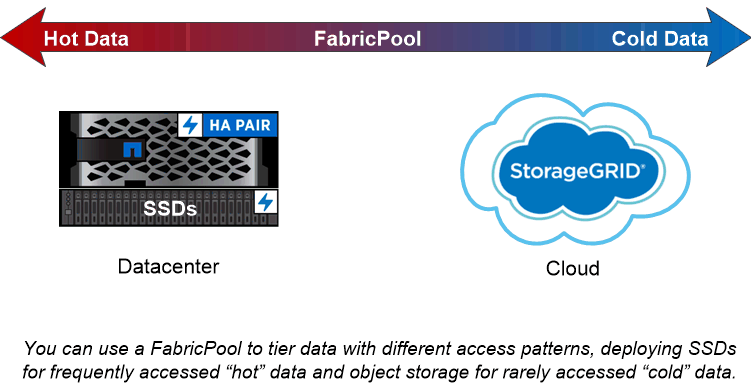

= Disks and aggregates overview
:icons: font
:imagesdir: ../media/

[.lead]
_Aggregates_ are containers for the disks managed by a node. You can use aggregates to isolate workloads with different performance demands, to tier data with different access patterns, or to segregate data for regulatory purposes.

* For business-critical applications that need the lowest possible latency and the highest possible performance, you might create an aggregate consisting entirely of SSDs.
* To tier data with different access patterns, you can create a _hybrid aggregate,_ deploying flash as high-performance cache for a working data set, while using lower-cost HDDs or object storage for less frequently accessed data. A _FlashPool_ consists of both SSDs and HDDs. A _FabricPool_ consists of an all-SSD aggregate with an attached object store.
* If you need to segregate archived data from active data for regulatory purposes, you can use an aggregate consisting of capacity HDDs, or a combination of performance and capacity HDDs.

