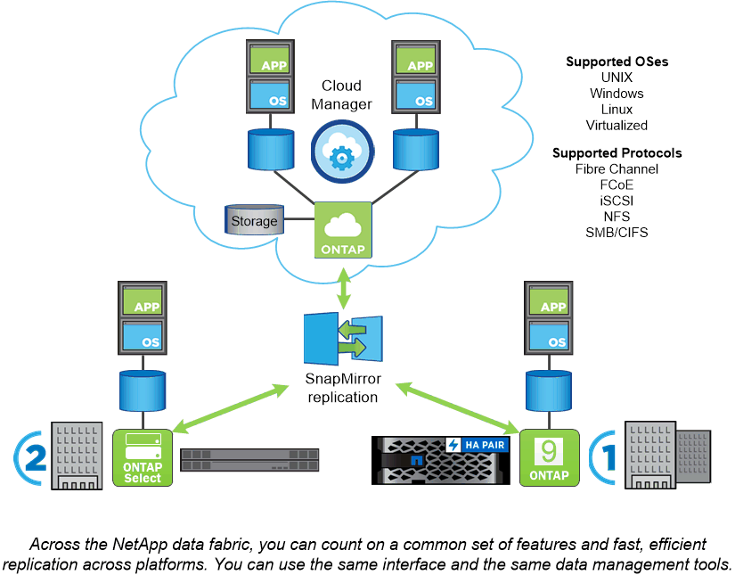

= ONTAP platforms
:icons: font
:imagesdir: ../media/

[.lead]
ONTAP data management software offers unified storage for applications that read and write data over block- or file-access protocols, in storage configurations that range from high-speed flash, to lower-priced spinning media, to cloud-based object storage.

ONTAP implementations run on NetApp-engineered FAS, AFF (including C-series and A-series), or ASA platforms on commodity hardware (ONTAP Select), and in private, public, or hybrid clouds (NetApp Private Storage or Cloud Volumes ONTAP). Specialized implementations offer best-in-class converged infrastructure (FlexPod Datacenter) and access to third-party storage arrays (FlexArray Virtualization).

Together these implementations form the basic framework of the _NetApp data fabric,_ with a common software-defined approach to data management and fast, efficient replication across platforms.

.About FlexPod Datacenter and FlexArray Virtualization

Although not represented in the illustration of the NetApp data fabric, FlexPod Datacenter and FlexArray Virtualization are key ONTAP implementations:

* FlexPod integrates best-in-class storage, networking, and compute components in a flexible architecture for enterprise workloads. Its converged infrastructure speeds the deployment of business-critical applications and cloud-based data center infrastructures.
* FlexArray is a front end for third-party and NetApp E-Series storage arrays, offering a uniform set of capabilities and streamlined data management. A FlexArray system looks like any other ONTAP system and offers all the same features.

// 2023 Jul 13, Jira 1123
// 2023 Jun 23, Jira 1123
// 2023 May 10, ontap issues 991
// 2022 september 6, ontap issues 624