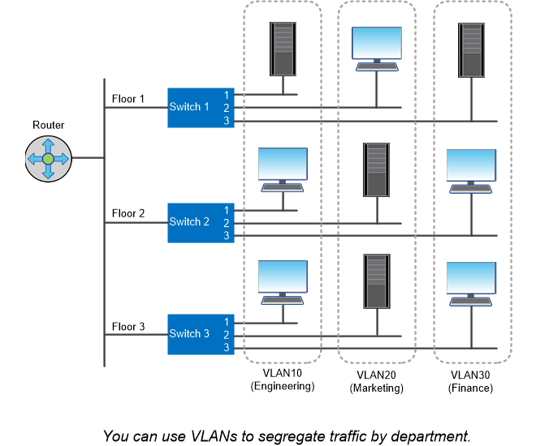

= Logical ports
:icons: font
:imagesdir: ../media/

[.lead]
In addition to the physical ports provided on each node, you can use _logical ports_ to manage network traffic. Logical ports are interface groups or VLANs.

== Interface groups

_Interface groups_ combine multiple physical ports into a single logical "`trunk port`". You might want to create an interface group consisting of ports from NICs in different PCI slots to ensure against a slot failure bringing down business-critical traffic.

An interface group can be single-mode, multimode, or dynamic multimode. Each mode offers differing levels of fault tolerance. You can use either type of multimode interface group to load-balance network traffic.

== VLANs 

_VLANs_ separate traffic from a network port (which could be an interface group) into logical segments defined on a switch port basis, rather than on physical boundaries. The _end-stations_ belonging to a VLAN are related by function or application.

You might group end-stations by department, such as Engineering and Marketing, or by project, such as release1 and release2. Because physical proximity of the end-stations is irrelevant in a VLAN, the end-stations can be geographically remote.

