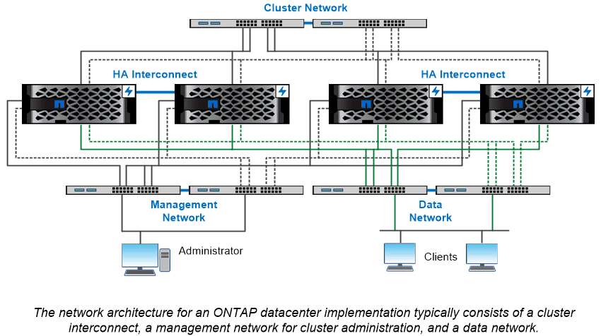

= Network architecture overview
:icons: font
:imagesdir: ../media/

[.lead]
The network architecture for an ONTAP datacenter implementation typically consists of a cluster interconnect, a management network for cluster administration, and a data network. NICs (network interface cards) provide physical ports for Ethernet connections. HBAs (host bus adapters) provide physical ports for FC connections.

