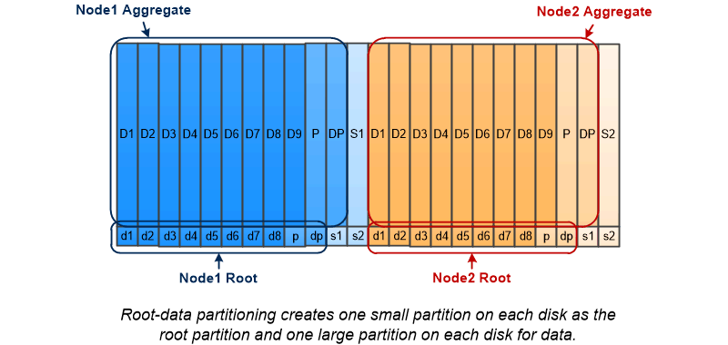
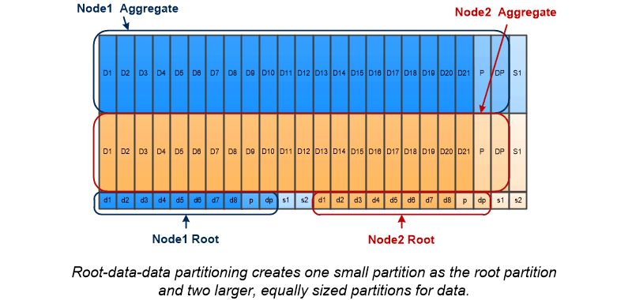

= Root-data partitioning
:icons: font
:imagesdir: ../media/

[.lead]
Every node must have a root aggregate for storage system configuration files. The root aggregate has the RAID type of the data aggregate.

System Manager does not support root-data or root-data-data partitioning. 

A root aggregate of type RAID-DP typically consists of one data disk and two parity disks. That's a significant "`parity tax`" to pay for storage system files, when the system is already reserving two disks as parity disks for each RAID group in the aggregate.

_Root-data partitioning_ reduces the parity tax by apportioning the root aggregate across disk partitions, reserving one small partition on each disk as the root partition and one large partition for data.

As the illustration suggests, the more disks used to store the root aggregate, the smaller the root partition. That's also the case for a form of root-data partitioning called _root-data-data partitioning_, which creates one small partition as the root partition and two larger, equally sized partitions for data.

Both types of root-data partitioning are part of the ONTAP _Advanced Drive Partitioning (ADP)_ feature. Both are configured at the factory: root-data partitioning for entry-level FAS2xxx, FAS9000, FAS8200, FAS80xx and AFF systems, root-data-data partitioning for AFF systems only.

// 25 march 2022, issue #426