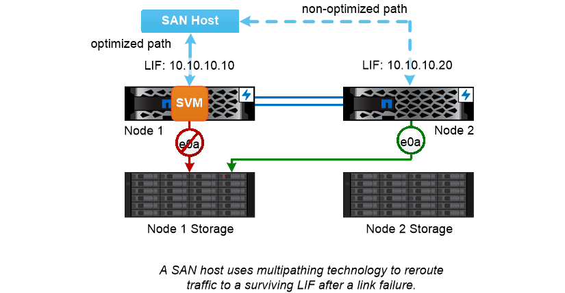

= SAN path failover
:icons: font
:imagesdir: ../media/

[.lead]
A SAN host uses ALUA (Asymmetric Logical Unit Access) and MPIO (multipath I/O) to reroute traffic to a surviving LIF after a link failure. Predefined paths determine the possible routes to the LUN served by the SVM.

In a SAN environment, hosts are regarded as _initiators_ of requests to LUN _targets._ MPIO enables multiple paths from initiators to targets. ALUA identifies the most direct paths, called _optimized paths._

You typically configure multiple optimized paths to LIFs on the LUN's owning node, and multiple non-optimized paths to LIFs on its HA partner. If one port fails on the owning node, the host routes traffic to the surviving ports. If all the ports fail, the host routes traffic over the non-optimized paths.

ONTAP Selective LUN Map (SLM) limits the number of paths from the host to a LUN by default. A newly created LUN is accessible only through paths to the node that owns the LUN or its HA partner. You can also limit access to a LUN by configuring LIFs in a _port set_ for the initiator.

|===
a|
*_Moving volumes in SAN environments_*

By default, ONTAP _Selective LUN Map (SLM)_ limits the number of paths to a LUN from a SAN host. A newly created LUN is accessible only through paths to the node that owns the LUN or its HA partner, the _reporting nodes_ for the LUN.

This means that when you move a volume to a node on another HA pair, you need to add reporting nodes for the destination HA pair to the LUN mapping. You can then specify the new paths in your MPIO setup. After the volume move is complete, you can delete the reporting nodes for the source HA pair from the mapping.

|===

// 2023 Nov 09, Jira 1466