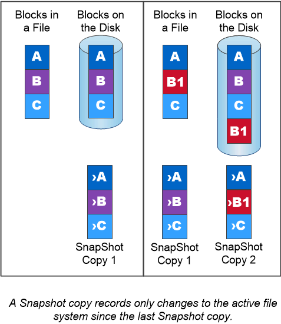

= Snapshot copies
:icons: font
:imagesdir: ../media/

[.lead]
Traditionally, ONTAP replication technologies served the need for disaster recovery (DR) and data archiving. With the advent of cloud services, ONTAP replication has been adapted to data transfer between endpoints in the NetApp data fabric. The foundation for all these uses is ONTAP Snapshot technology.

A _Snapshot copy_ is a read-only, point-in-time image of a volume. The image consumes minimal storage space and incurs negligible performance overhead because it records only changes to files since the last Snapshot copy was made.

Snapshot copies owe their efficiency to ONTAP's core storage virtualization technology, its _Write Anywhere File Layout (WAFL)._ Like a database, WAFL uses metadata to point to actual data blocks on disk. But, unlike a database, WAFL does not overwrite existing blocks. It writes updated data to a new block and changes the metadata.

Snapshot copies are efficient because, rather copy data blocks ,ONTAP references metadata when creating a Snapshot copy. Doing so eliminates both the "seek time" that other systems incur in locating the blocks to copy and the cost of making the copy itself.

You can use a Snapshot copy to recover individual files or LUNs, or to restore the entire contents of a volume. ONTAP compares pointer information in the Snapshot copy with data on disk to reconstruct the missing or damaged object, without downtime or a significant performance cost.

A _Snapshot policy_ defines how the system creates Snapshot copies of volumes. The policy specifies when to create the Snapshot copies, how many copies to retain, how to name them, and how to label them for replication. For example, a system might create one Snapshot copy every day at 12:10 a.m., retain the two most recent copies, name them "`daily`" (appended with a timestamp), and label them "`daily`" for replication.

