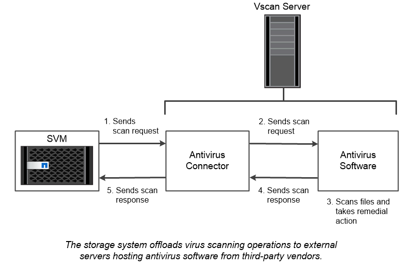

= Virus scanning
:icons: font
:imagesdir: ../media/

[.lead]
You can use integrated antivirus functionality on the storage system to protect data from being compromised by viruses or other malicious code. ONTAP virus scanning, called _Vscan_, combines best-in-class third-party antivirus software with ONTAP features that give you the flexibility you need to control which files get scanned and when.

Storage systems offload scanning operations to external servers hosting antivirus software from third-party vendors. The _ONTAP Antivirus Connector_, provided by NetApp and installed on the external server, handles communications between the storage system and the antivirus software.

* You can use _on-access scanning_ to check for viruses when clients open, read, rename, or close files over SMB. File operation is suspended until the external server reports the scan status of the file. If the file has already been scanned, ONTAP allows the file operation. Otherwise, it requests a scan from the server.
+
On-access scanning isn't supported for NFS.
* You can use _on-demand scanning_ to check files for viruses immediately or on a schedule. You might want to run scans only in off-peak hours, for example. The external server updates the scan status of the checked files, so that file-access latency for those files (assuming they have not been modified) is typically reduced when they are next accessed over SMB.
+
You can use on-demand scanning for any path in the SVM namespace, even for volumes that are exported only through NFS.

You typically enable both scanning modes on an SVM. In either mode, the antivirus software takes remedial action on infected files based on your settings in the software.

|===
a|
*_Virus scanning in disaster recovery and MetroCluster configurations_*

For disaster recovery and MetroCluster configurations, you must set up separate Vscan servers for the local and partner clusters.

|===

// 2022-03-07, ontap-issues-387