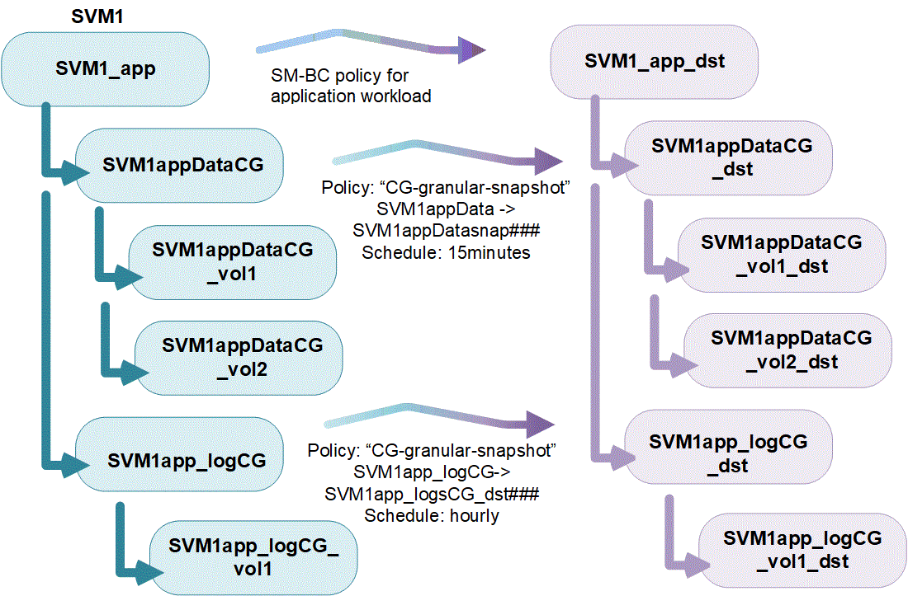

= Consistency groups overview
:icons: font
:imagesdir: ../media/

[.lead]
A consistency group is a collection of volumes that are managed as a single unit. In ONTAP, consistency groups provide easy management and a protection guarantee for an application workload spanning multiple volumes.

You can use consistency groups to simplify your storage management. Imagine you have an important database spanning twenty LUNs. You could manage the LUNs on an individual basis or treat the LUNs as a solitary dataset, organizing them into a single consistency group.

Consistency groups facilitate application workload management, providing easily configured local and remote protection policies and simultaneous crash-consistent or application-consistent Snapshot copies of a collection of volumes at a point in time. Snapshots in consistency groups enable an entire application workload to be restored.

== Understand consistency groups

Consistency groups support any FlexVol volume regardless of protocol (NAS, SAN, or NVMe) and can be managed through the ONTAP REST API or in System Manager under the *Storage > Consistency Groups* menu item.

Consistency groups can exist as individual entities--as a collection of volumes--or in a hierarchical relationship, which consists of other consistency groups. Individual volumes can have their own volume-granular snapshot policy. In addition, there can be a consistency group-wide snapshot policy. The consistency group can only have one SnapMirror Business Continuity (SM-BC) relationship and shared SM-BC policy, which can be used to recover the entire consistency group.

The following diagram illustrates how you might use an individual consistency group. The data for an application hosted on `SVM1` spans two volumes: `vol1` and `vol2`. A Snapshot policy on the consistency group captures snapshots of the data every 15 minutes.   

image:../media/consistency-group-single-diagram.gif[Diagram of a single consistency group with its constituent volumes and local Snapshot policy]

Larger application workloads might require multiple consistency groups. In these situations, you can create hierarchical consistency groups, where a single consistency group becomes the child components of a parent consistency group. The parent consistency group can include up to five child consistency groups. Like in individual consistency groups, a remote SM-BC protection policy can be applied to the entire configuration of consistency groups (parent and children) to recover the application workload.

In the following example, an application is hosted on `SVM1`. The administrator has created a parent consistency group, `SVM1_app`, which includes two child consistency groups: `SVM1appDataCG` for the data and `SVM1app_logCG` for the logs. Each child consistency group has its own snapshot policy. Snapshots of the volumes in `SVM1appDataCG` are taken every 15 minutes. Snapshots of `SVM1app_logCG` are taken hourly. The parent consistency group `SVM1_app` has an SM-BC policy which replicates the data to ensure continued service in the event of a disaster.

Beginning with ONTAP 9.12.1, consistency groups support xref:clone-task.html[cloning] and modifying the members of the consistency by xref:modify-task.html[adding or removing volumes] in both System Manager and the ONTAP REST API. Beginning in ONTAP 9.12.1, the ONTAP REST API also supports: 

* Creating consistency groups with new NFS or SMB volumes or NVMe namespaces. 
* Adding new or existing NFS or SMB volumes or NVMe namespaces to existing consistency groups. 

For more information about the ONTAP REST API, refer to https://docs.netapp.com/us-en/ontap-automation/reference/api_reference.html#access-a-copy-of-the-ontap-rest-api-reference-documentation[ONTAP REST API reference documentation]. 

== Monitor consistency groups

Beginning in ONTAP 9.13.1, consistency groups offer real-time and historical capacity and performance monitoring, offering insights about the performance of applications and individual consistency groups. 

Consistency group monitoring data is maintained for up to one year. You can track metrics for:

* Performance: IOPS, latency, and throughput
* Capacity: Size, available capacity, used capacity

[NOTE]
You can retrieve historical metrics only with the REST API. Historical metrics are not viewable in System Manager. 

== Protect consistency groups

Consistency groups offer protection through:

* Snapshot policies
* xref:../smbc/index.html[SnapMirror Business Continuity (SM-BC)]
* <<mcc>> (beginning 9.11.1)
* xref:../data-protection/snapmirror-disaster-recovery-concept.html[Asynchronous SnapMirror] (beginning 9.13.1)

Creating a consistency group does not automatically enable protection. Local and remote protection policies can be set when creating or after creating a consistency group. 

To configure protection on a consistency group, see link:protect-task.html[Protect a consistency group].

In order to utilize remote protection, you must meet the requirements for xref:../smbc/smbc_plan_prerequisites.html#licensing[SnapMirror Business Continuity deployments].

[NOTE]
SM-BC relationships cannot be established on volumes mounted for NAS access.

[[mcc,MetroCluster]] 
== Consistency groups in MetroCluster configurations

Beginning with ONTAP 9.11.1, you can provision consistency groups with new volumes on a cluster within a MetroCluster configuration. These volumes are provisioned on mirrored aggregates.

After they are provisioned, you can move volumes associated with consistency groups between mirrored and unmirrored aggregates. Therefore, volumes associated with consistency groups can be located on mirrored aggregates, unmirrored aggregates, or both. You can modify mirrored aggregates containing volumes associated with consistency groups to become unmirrored. Similarly, you can modify unmirrored aggregates containing volumes associated with consistency groups to enable mirroring.

Volumes associated and Snapshots associated with consistency groups placed on mirrored aggregates are replicated to the remote site (site B). The contents of the volumes on site B provide a write-order guarantee for the consistency group, allowing you to recover from site B in the event of a disaster. You can access replicated consistency group Snapshots using consistency group Snapshot REST API and System Manager on clusters running ONTAP 9.11.1 or later.

If some or all the volumes associated with a consistency group are located on unmirrored aggregates that are not currently accessible, GET or DELETE operations on the consistency group behave as if the local volumes or hosting aggregates are offline.

=== Consistency group configurations for replication

If site B is running ONTAP 9.10.1 or earlier, only the volumes associated with the consistency groups located on mirrored aggregates are replicated to site B. The consistency group configurations are only replicated to site B, if both sites are running ONTAP 9.11.1 or later. After site B is upgraded to ONTAP 9.11.1, data for consistency groups on site A that have all their associated volumes placed on mirrored aggregates are replicated to site B.

== Upgrade considerations

Consistency groups created with SM-BC in ONTAP 9.8 and 9.9.1 will automatically be upgraded and become manageable under *Storage > Consistency Groups* in System Manager or the ONTAP REST API when upgrading to ONTAP 9.10.1 or later. For more information about upgrading from ONTAP 9.8 or 9.9.1, see link:../smbc/smbc_admin_upgrade_and_revert_considerations.html[SM-BC upgrade and revert considerations].

Consistency group snapshots created in the REST API can be managed through System Manager's Consistency Group interface and through consistency group REST API endpoints.

[NOTE]
Snapshots created with the ONTAPI commands `cg-start` and `cg-commit` will not be recognized as consistency group Snapshots and thus cannot be managed through System Manager's consistency group interface or the consistency group endpoints in the ONTAP REST API.

== Supported features by release

[options="header", cols="3,1,1,1,1,1"]
|===
| | ONTAP 9.14.1 | ONTAP 9.13.1  | ONTAP 9.12.1 | ONTAP 9.11.1 | ONTAP 9.10.1 
| Hierarchical consistency groups | X | X | X | X | X 
| Local Snapshot protection | X | X | X | X | X 
| SnapMirror Business Continuity | X | X | X | X | X 
| MetroCluster support | X | X | X | X | 
| Two-phase commits (REST API only) | X | X | X | X | 
| Application and component tags | X | X | X | | 
| Clone consistency groups | X | X | X | | 
| Add and remove volumes | X | X | X | | 
| Create CGs with new NAS volumes | X | X | REST API only | | 
| Create CGs with new NVMe Namespaces | X | X | REST API only | | 
| Move volumes between child consistency groups | X |  X | | | 
| Modify consistency group geometry | X | X | | | 
| Monitoring | X | X | | | 
| Async SnapMirror (single consistency groups only) | X | X | | |
| CLI support | X | | | | |
|===

== Learn more about consistency groups

video::j0jfXDcdyzE[youtube, width=848, height=480]

.More information
* link:https://docs.netapp.com/us-en/ontap-automation/[ONTAP Automation documentation^]
* xref:../smbc/index.html[SnapMirror Business Continuity]
* xref:../data-protection/snapmirror-disaster-recovery-concept.html[Asynchronous SnapMirror disaster recovery basics]
* link:https://docs.netapp.com/us-en/ontap-metrocluster/[MetroCluster documentation]

// 28 july 2023, ontapdoc-1088
// 22 march 2023, ontapdoc-867
// 13 MAR 2023, ONTAPDOC-755
// 9 Feb 2023, ONTAPDOC-880
// 29 October 2021, BURT 1401394, IE-364, IE-364
// BURT 1448684, 20 JAN 2021
// BURT 1449057, 24 JAN 2021
// 22 april 2022, issue #456
// IE-473, 13 april 2022
