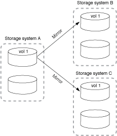
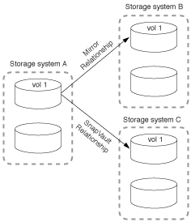
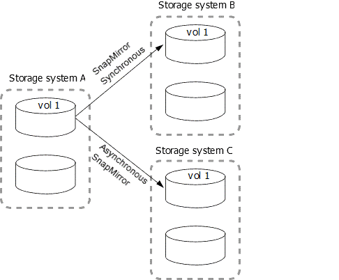
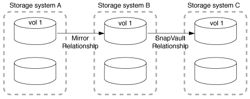

= Fan-out and cascade data protection deployments
:icons: font
:imagesdir: ../media/

[.lead]
You can use a _fan-out_ deployment to extend data protection to multiple secondary systems. You can use a _cascade_ deployment to extend data protection to tertiary systems.

Both fan-out and cascade deployments support any combination of SnapMirror DR, SnapVault, or unified replication; however, SnapMirror Synchronous relationships (supported beginning with ONTAP 9.5) support only fan-out deployments with one or more asynchronous SnapMirror relationships and do not support cascade deployments. Only one relationship in the fan-out configuration can be a SnapMirror Synchronous relationship, all the other relationships from the source volume must be asynchronous SnapMirror relationships. xref:../smbc/smbc_admin_what_happens_during_an_automatic_unplanned_failover.html#resume-protection-in-a-fan-out-configuration-after-failover[SnapMirror Business Continuity] (supported beginning with ONTAP 9.8) also supports fan-out configurations.

[NOTE]
You can use a _fan-in_ deployment to create data protection relationships between multiple primary systems and a single secondary system. Each relationship must use a different volume on the secondary system.

[NOTE]
You should be aware that volumes that are part of a fan-out or cascade configuration can take longer to
resynchronize. It is not uncommon to see the SnapMirror relationship reporting
the status "preparing" for an extended time period.

== How fan-out deployments work

SnapMirror supports _multiple-mirrors_ and _mirror-vault_ fan-out deployments.

A multiple-mirrors fan-out deployment consists of a source volume that has a mirror relationship to multiple secondary volumes.

A mirror-vault fan-out deployment consists of a source volume that has a mirror relationship to a secondary volume and a SnapVault relationship to a different secondary volume.

Beginning with ONTAP 9.5, you can have fan-out deployments with SnapMirror Synchronous relationships; however, only one relationship in the fan-out configuration can be a SnapMirror Synchronous relationship, all the other relationships from the source volume must be asynchronous SnapMirror relationships.

== How cascade deployments work

SnapMirror supports _mirror-mirror_, _mirror-vault_, _vault-mirror_, and _vault-vault_ cascade deployments.

A mirror-mirror cascade deployment consists of a chain of relationships in which a source volume is mirrored to a secondary volume, and the secondary volume is mirrored to a tertiary volume. If the secondary volume becomes unavailable, you can synchronize the relationship between the primary and tertiary volumes without performing a new baseline transfer.

Beginning with ONTAP 9.6, SnapMirror Synchronous relationships are supported in a mirror-mirror cascade deployment. Only the primary and secondary volumes can be in a SnapMirror Synchronous relationship. The relationship between the secondary volumes and tertiary volumes must be asynchronous.

image::../media/sm-mirror-mirror-cascade.png[SnapMirror deployment: Source to mirror-mirror cascade chain]

A mirror-vault cascade deployment consists of a chain of relationships in which a source volume is mirrored to a secondary volume, and the secondary volume is vaulted to a tertiary volume.

Vault-mirror and, beginning with ONTAP 9.2, vault-vault cascade deployments are also supported:

* A vault-mirror cascade deployment consists of a chain of relationships in which a source volume is vaulted to a secondary volume, and the secondary volume is mirrored to a tertiary volume.
* (Beginning with ONTAP 9.2) A vault-vault cascade deployment consists of a chain of relationships in which a source volume is vaulted to a secondary volume, and the secondary volume is vaulted to a tertiary volume.

.Further Reading
* xref:../smbc/resume-protection-fan-out-configuration.html[Resume protection in a fan-out configuration with SM-BC ]

// 08 DEC 2021, BURT 1430515
// 2022-2-14, BURT 1364426
// BURT 1459339, 22/02/2022
