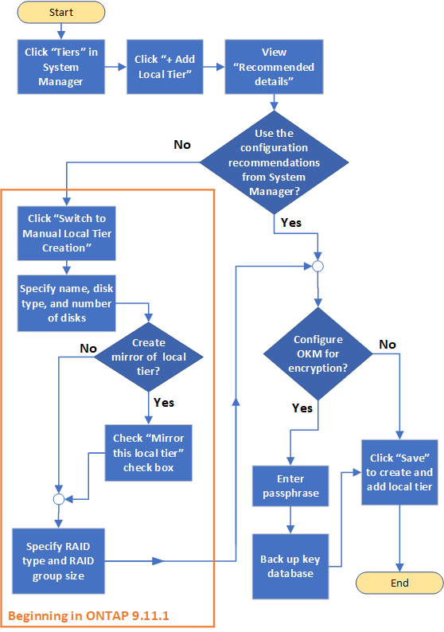
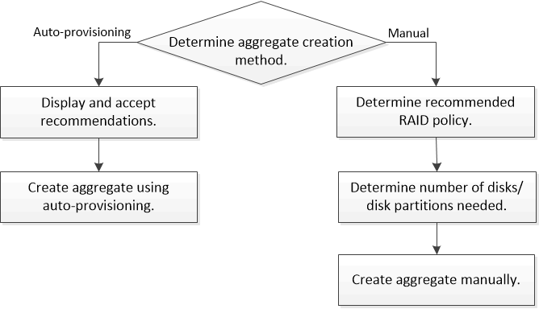

= Overview of adding a local tier (aggregate)
:icons: font
:imagesdir: ../media/

[.lead]
Creating local tiers (aggregates) provides storage to volumes on your system.

The workflow for creating local tiers (aggregates) is specific to the interface you use--System Manager or the CLI:

[role="tabbed-block"]
====
.System Manager workflow
--
*Add (create) a local tier with System Manager*

System Manager creates local tiers based on recommended best practices for configuring local tiers.

Beginning with ONTAP 9.11.1, you can decide to configure local tiers manually if you want a different configuration than the one recommended during the automatic process to add a local tier.

--

.CLI workflow
--
*Add (create) an aggregate with the CLI*

Beginning with ONTAP 9.2, ONTAP can provide recommended configurations when you create aggregates (auto-provisioning).  If the recommended configurations, based on best practices, are appropriate in your environment, you can accept them to create the aggregates. Otherwise, you can create aggregates manually.

--
====

// IE-529, 10 MAY 2022, restructuring
