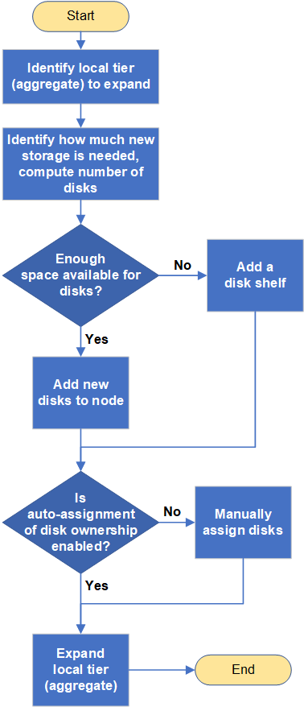

= Aggregate expansion workflow
:icons: font
:imagesdir: ../media/

[.lead]
Expanding an aggregate involves identifying the aggregate to expand, determining how much new storage is needed, installing new disks, assigning disk ownership, and creating new a RAID group if needed.

