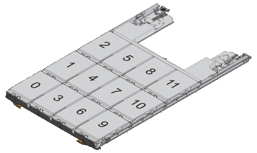

= Manually assign ownership of partitioned disks
:icons: font
:imagesdir: ../media/

[.lead]
You can manually assign the ownership of the container disk or the partitions on Advanced Drive Partitioning (ADP) systems. If you are initializing an HA pair that only has DS460C shelves, you must manually assign ownership for the container drives that will include root partitions.

.About this task
* The type of storage system you have determines which method of ADP is supported, root-data (RD) or root-data-data (RD2). 
+
FAS storage systems use RD and AFF storage systems use RD2.  
* If you are manually assigning ownership in an HA pair that is not being initialized and does not have only DS460C shelves, use option 1 to manually assign disks with root-data (RD) partitioning or use option 2 to manually assign disks with root-data-data (RD2) partitioning.
* If you are initializing an HA pair that has only DS460C shelves, use option 3 to manually assign ownership for the container drives that have the root partition.

.Option 1: Manually assign disks with root-data (RD) partitioning
[%collapsible]

====
For root-data partitioning, there are three owned entities (the container disk and the two partitions) collectively owned by the HA pair.

.About this task
* The container disk and the two partitions do not all need to be owned by the same node in the HA pair as long as they are all owned by one of the nodes in the HA pair. However, when you use a partition in a local tier (aggregate), it must be owned by the same node that owns the local tier.
* If a container disk fails in a half-populated shelf and is replaced, you might need to manually assign disk ownership because ONTAP does not always auto-assign ownership in this case.  
* After the container disk is assigned, ONTAP’s software automatically handles any partitioning and partition assignments that are required. 

.Steps

. Use the CLI to display the current ownership for the partitioned disk:
+
`storage disk show -disk _disk_name_ -partition-ownership`
. Set the CLI privilege level to advanced:
+
`set -privilege advanced`
. Enter the appropriate command, depending on which ownership entity you want to assign ownership for:
+
If any of the ownership entities are already owned, then you must include the "`-force`" option.
+

[cols="25,75"]
|===

h| If you want to assign ownership for the... h| Use this command...

a|
Container disk
a|
`storage disk assign -disk _disk_name_ -owner _owner_name_`
a|
Data partition
a|
`storage disk assign -disk _disk_name_ -owner _owner_name_ -data true`
a|
Root partition
a|
`storage disk assign -disk _disk_name_ -owner _owner_name_ -root true`
|===

====

.Option 2: Manually assign disks with root-data-data (RD2) partitioning
[%collapsible]

====
For root-data-data partitioning, there are four owned entities (the container disk and the three partitions) collectively owned by the HA pair. Root-data-data partitioning creates one small partition as the root partition and two larger, equally sized partitions for data.

.About this task

* Parameters must be used with the `disk assign` command to assign the proper partition of a root-data-data partitioned disk. You cannot use these parameters with disks that are part of a storage pool. The default value is "`false`".
** The `-data1 true` parameter assigns the "`data1`" partition of a root-data1-data2 partitioned disk.
** The `-data2 true` parameter assigns the "`data2`" partition of a root-data1-data2 partitioned disk.
* If a container disk fails in a half-populated shelf and is replaced, you might need to manually assign disk ownership because ONTAP does not always auto-assign ownership in this case. 
* After the container disk is assigned, ONTAP’s software automatically handles any partitioning and partition assignments that are required. 

.Steps

. Use the CLI to display the current ownership for the partitioned disk:
+
`storage disk show -disk _disk_name_ -partition-ownership`
. Set the CLI privilege level to advanced:
+
`set -privilege advanced`
. Enter the appropriate command, depending on which ownership entity you want to assign ownership for:
+
If any of the ownership entities are already owned, then you must include the "`-force`" option.
+
[cols="25,75"]
|===

h| If you want to assign ownership for the... h| Use this command...

a|
Container disk
a|
`storage disk assign -disk _disk_name_ -owner _owner_name_`
a|
Data1 partition
a|
`storage disk assign -disk _disk_name_ -owner _owner_name_ -data1 true`
a|
Data2 partition
a|
`storage disk assign -disk _disk_name_ -owner _owner_name_ -data2 true`
a|
Root partition
a|
`storage disk assign -disk _disk_name_ -owner _owner_name_ -root true`
|===

====
.Option 3: Manually assign DS460C container drives that have the root partition
[%collapsible]

====
If you are initializing an HA pair that has only DS460C shelves, you must manually assign ownership for the container drives that have the root partition by conforming to the half-drawer policy. 

.About this task
* When you initialize an HA pair that has only DS460C shelves, the ADP boot menu (available with ONTAP 9.2 and later) options 9a and 9b do not support automatic drive ownership assignment. You must manually assign the container drives that have the root partition by conforming to the half-drawer policy. 
+
After HA pair initialization (boot up), automatic assignment of disk ownership is automatically enabled and uses the half-drawer policy to assign ownership to the remaining drives (other than the container drives that have the root partition) and any drives added in the future, such as replacing failed drives, responding to a “low spares” message, or adding capacity.
* Learn about the half-drawer policy in the topic link:disk-autoassignment-policy-concept.html[About automatic assignment of disk ownership].

.Steps
. If your DS460C shelves are not fully populated, complete the following substeps; otherwise, go to the next step.
.. First, install drives in the front row (drive bays 0, 3, 6, and 9) of each drawer.
+
Installing drives in the front row of each drawer allows for proper air flow and prevents overheating.
.. For the remaining drives, evenly distribute them across each drawer.
+
Fill drawer rows from front to back. If you don’t have enough drives to fill rows, then install them in pairs so that drives occupy the left and right side of a drawer evenly.
+
The following illustration shows the drive bay numbering and locations in a DS460C drawer.
+

+
. Log into the clustershell using the node-management LIF or cluster-management LIF.
. For each drawer, manually assign the container drives that have the root partition by conforming to the half-drawer policy using the following substeps: 
+
The half-drawer policy has you assign the left half of a drawer’s drives (bays 0 to 5) to node A, and the right half of a drawer’s drives (bays 6 to 11) to node B. 
+
.. Display all unowned disks:  
`storage disk show -container-type unassigned`
.. Assign the container drives that have the root partition:
`storage disk assign -disk disk_name -owner owner_name`
+
You can use the wildcard character to assign more than one drive at a time. 

====

// ONTAPDOC-1176, 03-28-2024
// BURT 1485072, 08-30-2022
