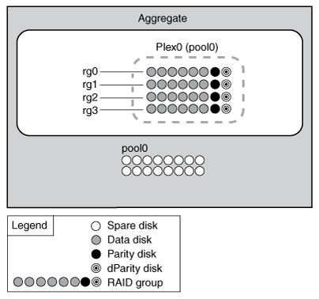
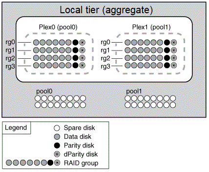
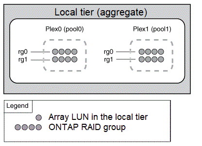

= Mirrored and unmirrored local tiers (aggregates)
:icons: font
:imagesdir: ../media/

[.lead]
ONTAP has an optional feature called _SyncMirror_ which you can use to synchronously mirror local tier (aggregate) data in copies, or _plexes_, stored in different RAID groups. Plexes ensure against data loss if more disks fail than the RAID type protects against, or if there is a loss of connectivity to RAID group disks.

When you create a local tier with System Manager or using the CLI, you can specify that the local tier is mirrored or unmirrored.

== How unmirrored local tiers (aggregates) work

If you do not specify that the local tiers are mirrored, then they are created as unmirrored local tiers (aggregates). Unmirrored local tiers have only one _plex_ (a copy of their data), which contains all of the RAID groups belonging to that local tier.

The following diagram shows an unmirrored local tier composed of disks, with its one plex. The local tier has four RAID groups: rg0, rg1, rg2, and rg3. Each RAID group has six data disks, one parity disk, and one dparity (double parity) disk. All disks used by the local tier come from the same pool, "`pool0`".

The following diagram shows an unmirrored local tier with array LUNs, with its one plex. It has two RAID groups, rg0 and rg1. All array LUNs used by the local tier come from the same pool, "`pool0`".

image::../media/unmirrored-aggregate-with-array-luns.gif[The diagram is described by the preceding text.]

== How mirrored local tiers (aggregates) work

Mirrored aggregates have two _plexes_ (copies of their data), which use the SyncMirror functionality to duplicate the data to provide redundancy.

When you create a local tier, you can specify that it is a mirrored local tier.  Also, you can add a second plex to an existing unmirrored local tier to make it a mirrored tier. Using SyncMirror functionality, ONTAP copies the data in the original plex (plex0) to the new plex (plex1). The plexes are physically separated (each plex has its own RAID groups and its own pool), and the plexes are updated simultaneously.

This configuration provides added protection against data loss if more disks fail than the RAID level of the aggregate protects against or if there is a loss of connectivity, because the unaffected plex continues to serve data while you fix the cause of the failure. After the plex that had a problem is fixed, the two plexes resynchronize and reestablish the mirror relationship.

The disks and array LUNs on the system are divided into two pools: "`pool0`" and "`pool1`". Plex0 gets its storage from pool0 and plex1 gets its storage from pool1.

The following diagram shows a local tier composed of disks with the SyncMirror functionality enabled and implemented. A second plex has been created for the local tier, "`plex1`". The data in plex1 is a copy of the data in plex0, and the RAID groups are also identical. The 32 spare disks are allocated to pool0 or pool1 using 16 disks for each pool.

The following diagram shows an local tier composed of array LUNs with the SyncMirror functionality enabled and implemented. A second plex has been created for the local tier, "`plex1`". Plex1 is a copy of plex0, and the RAID groups are also identical.

include:../_include/mirrored-aggregate-performance.adoc[]

// BURT 1485072, 08-30-2022
