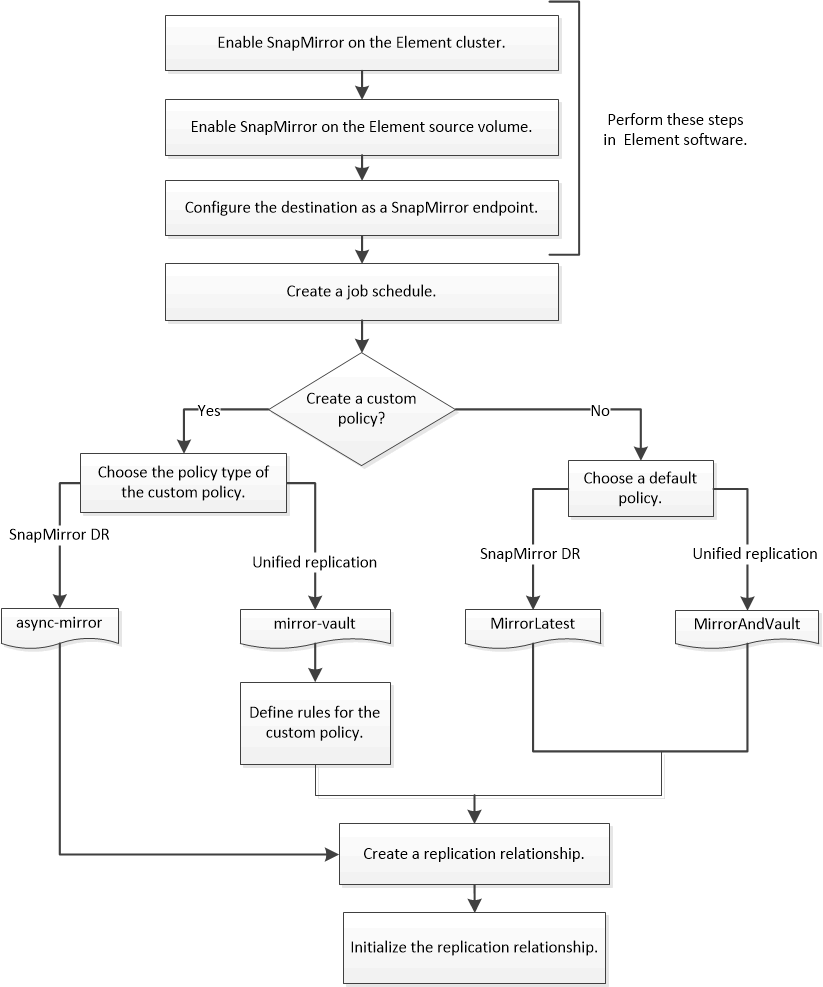

= Workflow for replication between Element and ONTAP
:icons: font
:imagesdir: ../media/

[.lead]
Whether you are replicating data from Element to ONTAP or from ONTAP to Element, you need to configure a job schedule, specify a policy, and create and initialize the relationship. You can use a default or custom policy.

The workflow assumes that you have completed the prerequisite tasks listed in xref:index.adoc#prerequisites[Prerequisites]. For complete background information on SnapMirror policies, including guidance on which policy to use, see link:../data-protection/index.html[Data protection].

// 2023 Nov 09, Jira 1466