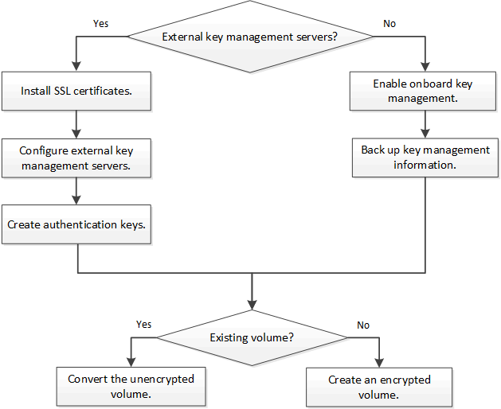

= NetApp Volume Encryption workflow
:icons: font
:imagesdir: ../media/

[.lead]
You must configure key management services before you can enable volume encryption. You can enable encryption on a new volume or on an existing volume.

