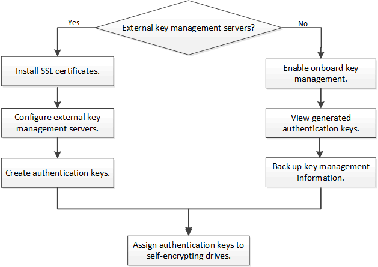

= Configure NetApp hardware-based encryption overview
:icons: font
:imagesdir: ../media/

[.lead]
NetApp hardware-based encryption supports full-disk encryption (FDE) of data as it is written. The data cannot be read without an encryption key stored on the firmware. The encryption key, in turn, is accessible only to an authenticated node.

== Understanding NetApp hardware-based encryption

A node authenticates itself to a self-encrypting drive using an authentication key retrieved from an external key management server or Onboard Key Manager:

* The external key management server is a third-party system in your storage environment that serves keys to nodes using the Key Management Interoperability Protocol (KMIP). It is a best practice to configure external key management servers on a different storage system from your data.
* The Onboard Key Manager is a built-in tool that serves authentication keys to nodes from the same storage system as your data.

You can use NetApp Volume Encryption with hardware-based encryption to "`double encrypt`" data on self-encrypting drives.

When self-encrypting drives are enabled, the core dump is also encrypted.

[NOTE]
If an HA pair is using encrypting SAS or NVMe drives (SED, NSE, FIPS), you must follow the instructions in the topic xref:return-seds-unprotected-mode-task.html[Returning a FIPS drive or SED to unprotected mode] for all drives within the HA pair prior to initializing the system (boot options 4 or 9). Failure to do this may result in future data loss if the drives are repurposed.

== Supported self-encrypting drive types

Two types of self-encrypting drives are supported:

* Self-encrypting FIPS-certified SAS or NVMe drives are supported on all FAS and AFF systems. These drives, called _FIPS drives,_ conform to the requirements of Federal Information Processing Standard Publication 140-2, level 2. The certified capabilities enable protections in addition to encryption, such as preventing denial-of-service attacks on the drive. FIPS drives cannot be mixed with other types of drives on the same node or HA pair.
* Beginning with ONTAP 9.6, self-encrypting NVMe drives that have not undergone FIPS testing are supported on AFF A800, A320, and later systems. These drives, called _SEDs_, offer the same encryption capabilities as FIPS drives, but can be mixed with non-encrypting drives on the same node or HA pair.
* All FIPS validated drives use a firmware cryptographic module that has been through FIPS validation.  The FIPS drive cryptographic module does not use any keys that are generated outside of the drive (the authentication passphrase that is input to the drive is used by the drive’s firmware cryptographic module to obtain a key encryption key).

NOTE: Non-encrypting drives are drives that are not SEDs or FIPS drives.

== When to use external key management

Although it is less expensive and typically more convenient to use the onboard key manager, you should use external key management if any of the following are true:

* Your organization’s policy requires a key management solution that uses a FIPS 140-2 Level 2 (or higher) cryptographic module.
* You need a multi-cluster solution, with centralized management of encryption keys.
* Your business requires the added security of storing authentication keys on a system or in a location different from the data.

== Support details

The following table shows important hardware encryption support details. See the Interoperability Matrix for the latest information about supported KMIP servers, storage systems, and disk shelves.

[cols="30,70"]
|===

h| Resource or feature h| Support details

a|
Non-homogeneous disk sets
a|

* FIPS drives cannot be mixed with other types of drives on the same node or HA pair. Conforming HA pairs can coexist with non-conforming HA pairs in the same cluster.
* SEDs can be mixed with non-encrypting drives on the same node or HA pair.

a|
Drive type
a|

* FIPS drives can be SAS or NVMe drives.
* SEDs must be NVMe drives.

a|
10 Gb network interfaces
a|
Beginning with ONTAP 9.3, KMIP key management configurations support 10 Gb network interfaces for communications with external key management servers.
a|
Ports for communication with the key management server
a|
Beginning with ONTAP 9.3, you can use any storage controller port for communication with the key management server. Otherwise, you should use port e0M for communication with key management servers. Depending on the storage controller model, certain network interfaces might not be available during the boot process for communication with key management servers.
a|
MetroCluster (MCC)
a|

* NVMe drives support MCC.
* SAS drives do not support MCC.

|===

== Hardware-based encryption workflow

You must configure key management services before the cluster can authenticate itself to the self-encrypting drive. You can use an external key management server or an onboard key manager.

.Related information

* link:https://hwu.netapp.com/[NetApp Hardware Universe^]

* link:https://www.netapp.com/pdf.html?item=/media/17070-ds-3899.pdf[NetApp Volume Encryption and NetApp Aggregate Encryption^]

// 2023 Nov 10, Jira 1466
// 1 may 2023, BURT 1329504, ONTAPDOC-1336
// 2022 jan 25, BURT 1452520
// BURT 1496026, Aug 10 2022
// ontap-issue-686, 25 OCT 2022
