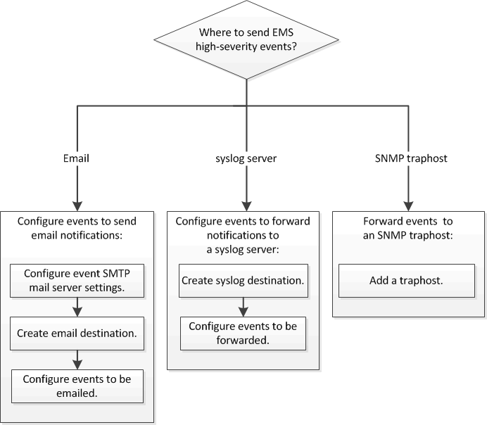

= EMS configuration workflow
:icons: font
:imagesdir: ../media/

[.lead]
You must configure important EMS event notifications to be sent either as email, forwarded to a syslog server, forwarded to an SNMP traphost, or forwarded to a REST API server. This helps you to avoid system disruptions by taking corrective actions in a timely manner.

