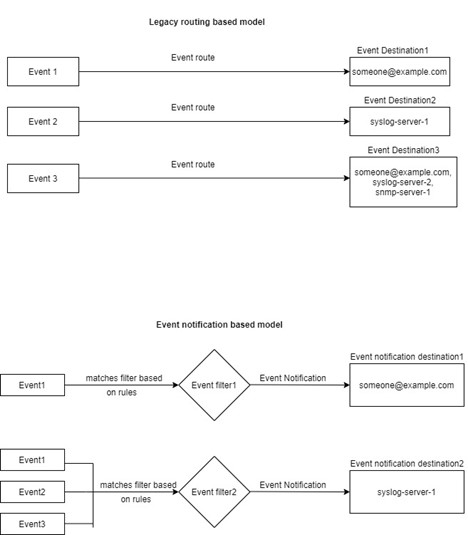

= Learn about ONTAP EMS event mapping models
:icons: font
:imagesdir: ../media/

[.lead]
Prior to ONTAP 9.0, EMS events could only be mapped to event destinations based on event name pattern matching. The ONTAP command sets (`event destination`, `event route`) that use this model continue to be available in the latest versions of ONTAP, but they have been deprecated starting with ONTAP 9.0.

Beginning with ONTAP 9.0, the best practice for ONTAP EMS event destination mapping is to use the more scalable event filter model in which pattern matching is done on multiple fields, using the `event filter`, `event notification`, and `event notification destination` command sets.

If your EMS mapping is configured using the deprecated commands, you should update your mapping to use the `event filter`, `event notification`, and `event notification destination` command sets.

There are two types of event destinations:

.	*System-generated destinations*: There are five system-generated event destinations (created by default)
+
* `allevents`
*	`asup`
*	`criticals`
*	`pager`
*	`traphost`
+
Some of the system-generated destinations are for special purpose. For example, the asup destination routes callhome.* events to the AutoSupport module in ONTAP to generate AutoSupport messages.
+
.	*User-created destinations*: These are manually created using the `event destination create` command.
+
----
cluster-1::event*> destination show
                                                                 Hide
Name             Mail Dest.        SNMP Dest.         Syslog Dest.       Params
---------------- ----------------- ------------------ ------------------ ------
allevents        -                 -                  -                  false
asup             -                 -                  -                  false
criticals        -                 -                  -                  false
pager            -                 -                  -                  false
traphost         -                 -                  -                  false
5 entries were displayed.
+
cluster-1::event*> destination create -name test -mail test@xyz.com
This command is deprecated. Use the "event filter", "event notification destination" and "event notification" commands, instead.
+
cluster-1::event*> destination show
+                                                                     Hide
Name             Mail Dest.        SNMP Dest.         Syslog Dest.       Params
---------------- ----------------- ------------------ ------------------ ------
allevents        -                 -                  -                  false
asup             -                 -                  -                  false
criticals        -                 -                  -                  false
pager            -                 -                  -                  false
test             test@xyz.com      -                  -                  false
traphost         -                 -                  -                  false
6 entries were displayed.
----

In the deprecated model, EMS events are individually mapped to a destination using the `event route add-destinations` command.

----
cluster-1::event*> route add-destinations -message-name raid.aggr.* -destinations test
This command is deprecated. Use the "event filter", "event notification destination" and "event notification" commands, instead.
4 entries were acted on.

cluster-1::event*> route show -message-name raid.aggr.*
                                                               Freq    Time
Message                          Severity       Destinations   Threshd Threshd
-------------------------------- -------------- -------------- ------- -------
raid.aggr.autoGrow.abort         NOTICE         test           0       0
raid.aggr.autoGrow.success       NOTICE         test           0       0
raid.aggr.lock.conflict          INFORMATIONAL  test           0       0
raid.aggr.log.CP.count           DEBUG          test           0       0
4 entries were displayed.
----

The new, more scalable EMS event notifications mechanism is based on event filters and event notification destinations. Refer to the following KB article for detailed information on the new event notification mechanism:

* link:https://kb.netapp.com/Advice_and_Troubleshooting/Data_Storage_Software/ONTAP_OS/FAQ%3A_Overview_of_Event_Management_System_for_ONTAP_9[Overview of Event Management System for ONTAP 9^]

// 2021-11-30, Created by Aoife
