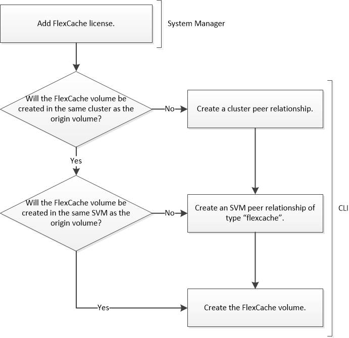

= FlexCache volume creation workflow
:icons: font
:imagesdir: ../media/

[.lead]
You must first install the FlexCache license from System Manager. You can then create a FlexCache volume in the same cluster or in a remote cluster by using the CLI.

You must be running ONTAP 9.5 or later.

You can use FlexCache volumes in the same cluster for accelerated performance when accessing hot volumes. You can use FlexCache volumes in different clusters for improving the performance of cross-cluster data distribution.

// 2023 Nov 09, Jira 1466
