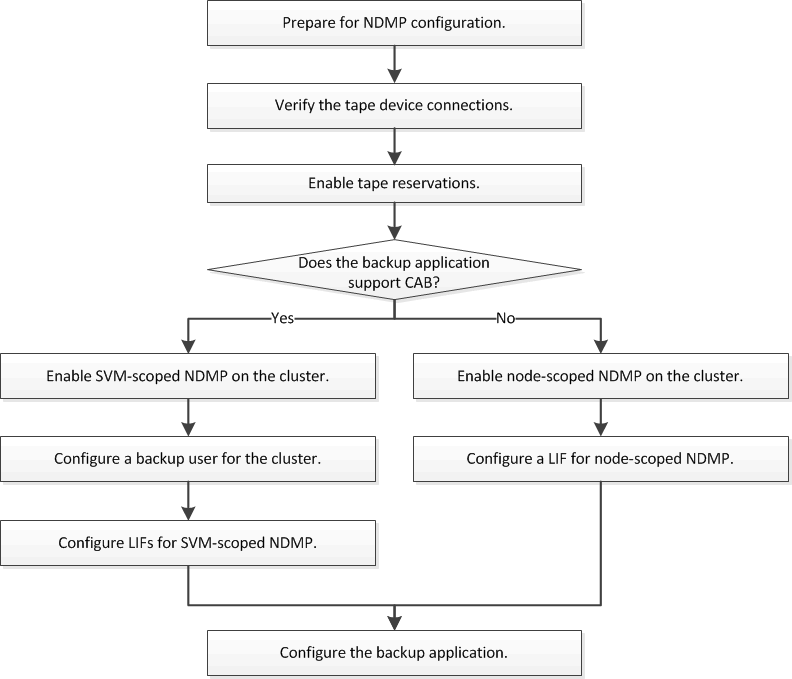

= NDMP configuration workflow
:icons: font
:imagesdir: ../media/

[.lead]
Setting up tape backup over NDMP involves preparing for NDMP configuration, verifying the tape device connections, enabling tape reservations, configuring NDMP at the SVM or node level, enabling NDMP on the cluster, configuring a backup user, configuring LIFs, and configuring the backup application.

// 2023 Nov 09, Jira 1466
