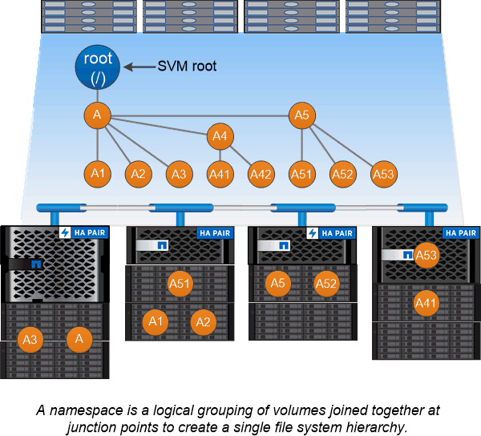

= Namespaces and junction points overview
:icons: font
:imagesdir: ../media/

[.lead]
A NAS _namespace_ is a logical grouping of volumes joined together at _junction points_ to create a single file system hierarchy. A client with sufficient permissions can access files in the namespace without specifying the location of the files in storage. Junctioned volumes can reside anywhere in the cluster.

Rather than mounting every volume containing a file of interest, NAS clients mount an NFS _export_ or access an SMB _share._ The export or share represents the entire namespace or an intermediate location within the namespace. The client accesses only the volumes mounted below its access point.

You can add volumes to the namespace as needed. You can create junction points directly below a parent volume junction or on a directory within a volume. A path to a volume junction for a volume named "`vol3`" might be `/vol1/vol2/vol3`, or `/vol1/dir2/vol3`, or even `/dir1/dir2/vol3`. The path is called the _junction path._

Every SVM has a unique namespace. The SVM root volume is the entry point to the namespace hierarchy.

[NOTE]
====
To ensure that data remains available in the event of a node outage or failover, you should create a _load-sharing mirror_ copy for the SVM root volume.
====

.Example

The following example creates a volume named "`home4`" located on SVM vs1 that has a junction path `/eng/home`:

----
cluster1::> volume create -vserver vs1 -volume home4 -aggregate aggr1 -size 1g -junction-path /eng/home
[Job 1642] Job succeeded: Successful
----

// 2023 Nov 10, Jira 1466