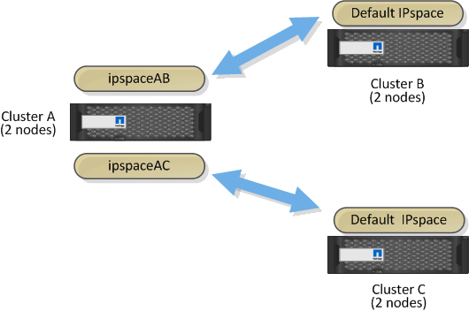

= Use custom IPspaces to isolate replication traffic
:icons: font
:imagesdir: ../media/

[.lead]
You can use custom IPspaces to separate the interactions that a cluster has with its peers. Called _designated intercluster connectivity_, this configuration allows service providers to isolate replication traffic in multitenant environments.

Suppose, for example, that you want replication traffic between Cluster A and Cluster B to be separated from replication traffic between Cluster A and Cluster C. To accomplish this, you can create two IPspaces on Cluster A.

One IPspace contains the intercluster LIFs that you use to communicate with Cluster B. The other contains the intercluster LIFs that you use to communicate with Cluster C, as shown in the following illustration.

For custom IPspace configuration, see the _Network Management Guide_.

// 2023 Nov 09, Jira 1466