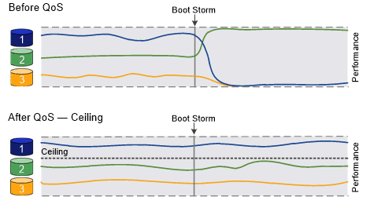
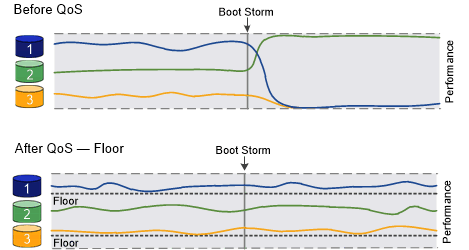

= Guarantee throughput with QoS overview
:icons: font
:imagesdir: ../media/

[.lead]
You can use storage quality of service (QoS) to guarantee that performance of critical workloads is not degraded by competing workloads. You can set a throughput _ceiling_ on a competing workload to limit its impact on system resources, or set a throughput _floor_ for a critical workload, ensuring that it meets minimum throughput targets, regardless of demand by competing workloads. You can even set a ceiling and floor for the same workload.

== About throughput ceilings (QoS Max)

A throughput ceiling limits throughput for a workload to a maximum number of IOPS or MBps, or IOPS and MBps. In the figure below, the throughput ceiling for workload 2 ensures that it does not "bully" workloads 1 and 3.

A _policy group_ defines the throughput ceiling for one or more workloads. A workload represents the I/O operations for a _storage object:_ a volume, file, qtree or LUN, or all the volumes, files, qtrees, or LUNs in an SVM. You can specify the ceiling when you create the policy group, or you can wait until after you monitor workloads to specify it.

[NOTE]
====
Throughput to workloads might exceed the specified ceiling by up to 10%, especially if a workload experiences rapid changes in throughput. The ceiling might be exceeded by up to 50% to handle bursts. Bursts occur on single nodes when tokens accumulate up to 150%
====

== About throughput floors (QoS Min)

A throughput floor guarantees that throughput for a workload does not fall below a minimum number of IOPS or MBps, or IOPS and MBps.In the figure below, the throughput floors for workload 1 and workload 3 ensure that they meet minimum throughput targets, regardless of demand by workload 2.

[TIP]
====
As the examples suggest, a throughput ceiling throttles throughput directly. A throughput floor throttles throughput indirectly, by giving priority to the workloads for which the floor has been set.
====

A policy group that defines a throughput floor cannot be applied to an SVM. You can specify the floor when you create the policy group, or you can wait until after you monitor workloads to specify it.

[NOTE]
====
In releases before ONTAP 9.7, throughput floors are guaranteed when there is sufficient performance capacity available. In ONTAP 9.7 and later, throughput floors can be guaranteed even when there is insufficient performance capacity available. This new floor behavior is called floors v2. To meet the guarantees, floors v2 can result in higher latency on workloads without a throughput floor or on work that exceeds the floor settings. Floors v2 applies to both QoS and adaptive QoS. The option of enabling/disabling the new behavior of floors v2 is available in ONTAP 9.7P6 and later.A workload might fall below the specified floor during critical operations like `volume move trigger-cutover`. Even when sufficient capacity is available and critical operations are not taking place, throughput to a workload might fall below the specified floor by up to 5%. If floors are overprovisioned and there is no performance capacity, some workloads might fall below the specified floor.

====

== About shared and non-shared QoS policy groups

Beginning with ONTAP 9.4, you can use a _non-shared_ QoS policy group to specify that the defined throughput ceiling or floor applies to each member workload individually. Behavior of _shared_ policy groups depends on the policy type:

* For throughput ceilings, the total throughput for the workloads assigned to the shared policy group cannot exceed the specified ceiling.
* For throughput floors, the shared policy group can be applied to a single workload only.

== About adaptive QoS

Ordinarily, the value of the policy group you assign to a storage object is fixed. You need to change the value manually when the size of the storage object changes. An increase in the amount of space used on a volume, for example, usually requires a corresponding increase in the throughput ceiling specified for the volume.

_Adaptive QoS_ automatically scales the policy group value to workload size, maintaining the ratio of IOPS to TBs|GBs as the size of the workload changes. That is a significant advantage when you are managing hundreds or thousands of workloads in a large deployment.

You typically use adaptive QoS to adjust throughput ceilings, but you can also use it to manage throughput floors (when workload size increases). Workload size is expressed as either the allocated space for the storage object or the space used by the storage object.

[NOTE]
====
Used space is available for throughput floors in ONTAP 9.5 and later. It is not supported for throughput floors in ONTAP 9.4 and earlier.
====

* An _allocated space_ policy maintains the IOPS/TB|GB ratio according to the nominal size of the storage object. If the ratio is 100 IOPS/GB, a 150 GB volume will have a throughput ceiling of 15,000 IOPS for as long as the volume remains that size. If the volume is resized to 300 GB, adaptive QoS adjusts the throughput ceiling to 30,000 IOPS.
* A _used space_ policy (the default) maintains the IOPS/TB|GB ratio according to the amount of actual data stored before storage efficiencies. If the ratio is 100 IOPS/GB, a 150 GB volume that has 100 GB of data stored would have a throughput ceiling of 10,000 IOPS. As the amount of used space changes, adaptive QoS adjusts the throughput ceiling according to the ratio.

Beginning with ONTAP 9.5, you can specify an I/O block size for your application that enables a throughput limit to be expressed in both IOPS and MBps. The MBps limit is calculated from the block size multiplied by the IOPS limit. For example, an I/O block size of 32K for an IOPS limit of 6144IOPS/TB yields an MBps limit of 192MBps.

You can expect the following behavior for both throughput ceilings and floors:

* When a workload is assigned to an adaptive QoS policy group, the ceiling or floor is updated immediately.
* When a workload in an adaptive QoS policy group is resized, the ceiling or floor is updated in approximately five minutes.

Throughput must increase by at least 10 IOPS before updates take place.

Adaptive QoS policy groups are always non-shared: the defined throughput ceiling or floor applies to each member workload individually.

Beginning with ONTAP 9.6, throughput floors is supported on ONTAP Select premium with SSD.

== General support

The following table shows the differences in support for throughput ceilings, throughput floors, and adaptive QoS.

|===

h| Resource or feature h| Throughput ceiling h| Throughput floor h| Throughput floor v2 h| Adaptive QoS

a|
ONTAP 9 version
a|
All
a|
9.2 and later
a|
9.7 and later
a|
9.3 and later
a|
Platforms
a|
All
a|

* AFF
* C190 *
* ONTAP Select premium with SSD *

a|

* AFF
* C190
* ONTAP Select premium with SSD

a|
All
a|
Protocols
a|
All
a|
All
a|
All
a|
All
a|
FabricPool
a|
Yes
a|
Yes, if the tiering policy is set to "none" and no blocks are in the cloud.
a|
Yes, if the tiering policy is set to "none" and no blocks are in the cloud.
a|
Yes
a|
SnapMirror Synchronous
a|
Yes
a|
No
a|
No
a|
Yes
|===

*C190 and ONTAP Select support started with the ONTAP 9.6 release.

== Supported workloads for throughput ceilings

The following table shows workload support for throughput ceilings by ONTAP 9 version. Root volumes, load-sharing mirrors, and data protection mirrors are not supported.

|===

h| Workload support - ceiling h| 9.0 h| 9.1 h| 9.2 h| 9.3 h| 9.4 and later h| 9.8 and later
a|
Volume
a|
yes
a|
yes
a|
yes
a|
yes
a|
yes
a|
yes
a|
File
a|
yes
a|
yes
a|
yes
a|
yes
a|
yes
a|
yes
a|
LUN
a|
yes
a|
yes
a|
yes
a|
yes
a|
yes
a|
yes
a|
SVM
a|
yes
a|
yes
a|
yes
a|
yes
a|
yes
a|
yes
a|
FlexGroup volume
a|
no
a|
no
a|
no
a|
yes
a|
yes
a|
yes
a|
qtrees*
a|
no
a|
no
a|
no
a|
no
a|
no
a|
yes
a|
Multiple workloads per policy group
a|
yes
a|
yes
a|
yes
a|
yes
a|
yes
a|
yes
a|
Non-shared policy groups
a|
no
a|
no
a|
no
a|
no
a|
yes
a|
yes
|===

*Beginning with ONTAP 9.8, NFS access is supported in qtrees in FlexVol and FlexGroup volumes with NFS enabled. Beginning with ONTAP 9.9.1, SMB access is also supported in qtrees in FlexVol and FlexGroup volumes with SMB enabled.

== Supported workloads for throughput floors

The following table shows workload support for throughput floors by ONTAP 9 version. Root volumes, load-sharing mirrors, and data protection mirrors are not supported.

|===

h| Workload support - floor h| 9.2 h| 9.3 h| 9.4 and later h| 9.8 and later

a|
Volume
a|
yes
a|
yes
a|
yes
a|
yes
a|
File
a|
no
a|
yes
a|
yes
a|
yes
a|
LUN
a|
yes
a|
yes
a|
yes
a|
yes
a|
SVM
a|
no
a|
no
a|
no
a|
no
// GitHub Issue 552, changed to "no"
a|
FlexGroup volume
a|
no
a|
no
a|
yes
a|
yes
a|
qtrees *
a|
no
a|
no
a|
no
a|
yes
a|
Multiple workloads per policy group
a|
no
a|
no
a|
yes
a|
yes
a|
Non-shared policy groups
a|
no
a|
no
a|
yes
a|
yes
|===

*Beginning with ONTAP 9.8, NFS access is supported in qtrees in FlexVol and FlexGroup volumes with NFS enabled. Beginning with ONTAP 9.9.1, SMB access is also supported in qtrees in FlexVol and FlexGroup volumes with SMB enabled.

== Supported workloads for adaptive QoS

The following table shows workload support for adaptive QoS by ONTAP 9 version. Root volumes, load-sharing mirrors, and data protection mirrors are not supported.

|===

h| Workload support - adaptive QoS h| 9.3 h| 9.4 and later

a|
Volume
a|
yes
a|
yes
a|
File
a|
no
a|
yes
a|
LUN
a|
no
a|
yes
a|
SVM
a|
no
a|
no
a|
FlexGroup volume
a|
no
a|
yes
a|
Multiple workloads per policy group
a|
yes
a|
yes
a|
Non-shared policy groups
a|
yes
a|
yes
|===

== Maximum number of workloads and policy groups

The following table shows the maximum number of workloads and policy groups by ONTAP 9 version.

|===

h| Workload support h| 9.3 and earlier h| 9.4 and later

a|
Maximum workloads per cluster
a|
12,000
a|
40,000
a|
Maximum workloads per node
a|
12,000
a|
40,000
a|
Maximum policy groups
a|
12,000
a|
12,000
|===

// 2022-07-20, BURT 1488888
// 2021-12-08, BURT 1430515
