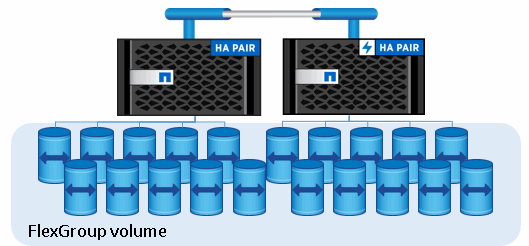
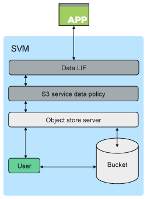

= Architecture
:icons: font
:imagesdir: ../media/

[.lead]
In ONTAP, the underlying architecture for a bucket is a link:https://docs.netapp.com/us-en/ontap/flexgroup/definition-concept.html[FlexGroup volume]--a single namespace that is made up of multiple constituent member volumes but is managed as a single volume.

Access to the bucket is provided through authorized users and client applications.

[NOTE]
====
When a bucket is used exclusively for S3 applications, including use as a FabricPool endpoint, the underlying FlexGroup volume will only support the S3 protocol.

Beginning in ONTAP 9.12.1, the S3 protocol can also be enabled in link:../s3-multiprotocol/index.html[multiprotocol NAS volumes] that have been preconfigured to use NAS protocols. When the S3 protocol is enabled in multiprotocol NAS volumes, client applications can read and write data using NFS, SMB, and S3.
====

== Bucket limits
The minimum bucket size is 95GB. + 
The maximum bucket size is limited to the maximum FlexGroup size of 60PB. 

There is a limit of 1000 buckets per FlexGroup volume, or 12,000 buckets per cluster (using 12 FlexGroup volumes).

== Automatic FlexGroup sizing with ONTAP 9.14.1 and later
Beginning in ONTAP 9.14.1, the default FlexGroup size is based on the size of the underlying buckets.
The FlexGroup volume will automatically grow or shrink as buckets are added or removed.

For example, if an initial Bucket_A is provisioned to be 100GB, the FlexGroup will be thin-provisioned to be 100GB. If two additional buckets are created, Bucket_B at 300GB and Bucket_C at 500GB, the
FlexGroup volume will grow to 900GB.

(Bucket_A at 100GB + Bucket_B at 300GB + Bucket_C at 500GB = 900GB.)

If Bucket_A is deleted, the underlying FlexGroup volume will shrink to 800GB.

== Fixed default FlexGroup sizes in ONTAP 9.13.1 and earlier
To provide capacity for bucket expansion, the total used capacity of all buckets on the FlexGroup volume should be less than 33% of the maximum FlexGroup volume capacity based on available storage aggregates on the cluster. 
If this cannot be met, the new bucket being created will be provisioned on a new, automatically created, FlexGroup volume.

Prior to ONTAP 9.14.1, the FlexGroup size is fixed to a default size based on its environment:

* 1.6PB in ONTAP
* 100TB in ONTAP Select

If a cluster does not have enough capacity to provision a FlexGroup volume at the default size, ONTAP reduces the default size by half until it can be provisioned in the existing environment.

For example, in a 300TB environment, a FlexGroup volume is automatically provisioned at 200TB (1.6PB, 800TB, and 400TB FlexGroup volumes being too large for the environment).

// 2024-April-4, ONTAPDOC-1808
// 2023 Nov 10, Jira 1466