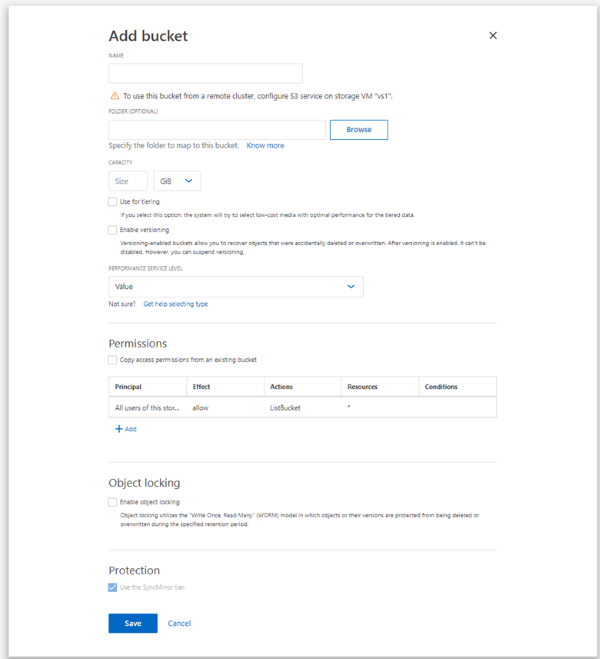

= Create a bucket on a mirrored or unmirrored aggregate in a MetroCluster configuration
:icons: font
:imagesdir: ../media/

[.lead]
Beginning with ONTAP 9.14.1, you can provision a bucket on a mirrored or unmirrored aggregate in MetroCluster FC and IP configurations. 

.About this task 

* By default, buckets are provisioned on mirrored aggregates. 
* The same provisioning guidelines outlined in link:create-bucket-task.html[Create a bucket] apply to creating a bucket in a MetroCluster environment.
* The following S3 object storage features are *not* supported in MetroCluster environments: 

** S3 SnapMirror
** S3 bucket lifecycle management
** S3 object lock in *Compliance* mode 
+
NOTE: S3 object lock in *Governance* mode is supported. 

** Local FabricPool tiering

.Before you begin

An SVM containing an S3 server must already exist.

== Process to create buckets

[role="tabbed-block"]
====
.CLI
--
. If you plan to select aggregates and FlexGroup components yourself, set the privilege level to advanced (otherwise, admin privilege level is sufficient): `set -privilege advanced`
. Create a bucket:
+
`vserver object-store-server bucket create -vserver <svm_name> -bucket <bucket_name> [-size integer[KB|MB|GB|TB|PB]] [-use-mirrored-aggregates true/false]`
+
Set the `-use-mirrored-aggregates` option to `true` or `false` depending on whether you want to use a mirrored or unmirrored aggregate.
+
* The SVM name must be a data SVM. 
+
* If you specify no options, ONTAP creates a 5GB bucket with the service level set to the highest level available for your system.
+
NOTE: By default, the `-use-mirrored-aggregates` option is set to `true`.

* If you want ONTAP to create a bucket based on performance or usage, use one of the following options:

 ** service level
+
Include the `-storage-service-level` option with one of the following values: `value`, `performance`, or `extreme`.

 ** tiering
+
Include the `-used-as-capacity-tier true` option.

* If you want to specify the aggregates on which to create the underlying FlexGroup volume, use the following options:

 ** The `-aggr-list` parameter specifies the list of aggregates to be used for FlexGroup volume constituents.
+
Each entry in the list creates a constituent on the specified aggregate. You can specify an aggregate multiple times to have multiple constituents created on the aggregate.
+
For consistent performance across the FlexGroup volume, all of the aggregates must use the same disk type and RAID group configurations.

 ** The `-aggr-list-multiplier` parameter specifies the number of times to iterate over the aggregates that are listed with the `-aggr-list` parameter when creating a FlexGroup volume.
+
The default value of the `-aggr-list-multiplier` parameter is 4.

. Add a QoS policy group if needed:
+
`vserver object-store-server bucket modify -bucket _bucket_name_ -qos-policy-group _qos_policy_group_`
. Verify bucket creation:
+
`vserver object-store-server bucket show [-instance]`

.Example

The following example creates a bucket for SVM vs1 of size 1TB on a mirrored aggregate:

----
cluster-1::*> vserver object-store-server bucket create -vserver svm1.example.com -bucket testbucket  -size 1TB -use-mirrored-aggregates true
----
--

.System Manager
--
.	Add a new bucket on an S3-enabled storage VM.
..	Click *Storage > Buckets*, then click *Add*.
..	Enter a name, select the storage VM, and enter a size.
+
By default, the bucket is provisioned on a mirrored aggregate. If you want to create a bucket on an unmirrored aggregate, select *More Options* and uncheck the *Use the SyncMirror tier* box under *Protection* as shown in the following image:
+

* If you click *Save* at this point, a bucket is created with these default settings:

**	No users are granted access to the bucket unless any group policies are already in effect.
+
NOTE: You should not use the S3 root user to manage ONTAP object storage and share its permissions, because it has unlimited access to the object store. Instead, create a user or group with administrative privileges that you assign.

**	A Quality of Service (performance) level that is the highest available for your system. 

*	You can click *More Options* to configure user permissions and performance level when you configure the bucket, or you can modify these settings later.

**	You must have already created user and groups before using *More Options* to configure their permissions.
**	If you intend to use the S3 object store for FabricPool tiering, consider selecting *Use for tiering* (use low-cost media with optimal performance for the tiered data) rather than a performance service level.

.	On S3 client apps – another ONTAP system or an external 3rd-party app – verify access to the new bucket by entering the following:

*	The S3 server CA certificate.
*	The user’s access key and secret key.
*	The S3 server FQDN name and bucket name.
--
====

// ONTAPDOC-1385, 2023 Oct 06