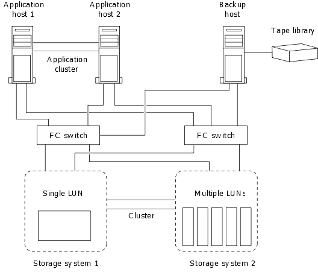

= How you can connect a host backup system to the primary storage system
:icons: font
:imagesdir: ../media/

[.lead]
You can back up SAN systems to tape through a separate backup host to avoid performance degradation on the application host.

It is imperative that you keep SAN and NAS data separated for backup purposes. The figure below shows the recommended physical configuration for a host backup system to the primary storage system. You must configure volumes as SAN-only. LUNs can be confined to a single volume or the LUNs can be spread across multiple volumes or storage systems.

Volumes on a host can consist of a single LUN mapped from the storage system or multiple LUNs using a volume manager, such as VxVM on HP-UX systems.

// 2023, Nov 09, Jira 1466