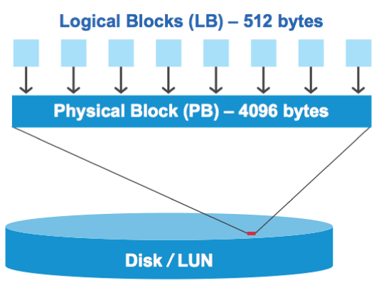

= I/O misalignments on properly aligned LUNs overview
:icons: font
:imagesdir: ../media/

[.lead]
ONTAP might report I/O misalignments on properly aligned LUNs. In general, these misalignment warnings can be disregarded as long as you are confident that your LUN is properly provisioned and your partitioning table is correct.

LUNs and hard disks both provide storage as blocks. Because the block size for disks on the host is 512 bytes, LUNs present blocks of that size to the host while actually using larger, 4-KB blocks to store data. The 512-byte data block used by the host is referred to as a logical block. The 4-KB data block used by the LUN to store data is referred to as a physical block. This means that there are eight 512-byte logical blocks in each 4-KB physical block.

The host operating system can begin a read or write I/O operation at any logical block. I/O operations are only considered aligned when they begin at the first logical block in the physical block. If an I/O operation begins at a logical block that is not also the start of a physical block, the I/O is considered misaligned. ONTAP automatically detects the misalignment and reports it on the LUN. However, the presence of misaligned I/O does not necessarily mean that the LUN is also misaligned. It is possible for misaligned I/O to be reported on properly aligned LUNs.

If you require further investigation, see the Knowledge Base article link:https://kb.netapp.com/Advice_and_Troubleshooting/Data_Storage_Software/ONTAP_OS/How_to_identify_unaligned_IO_on_LUNs[How to identify unaligned IO on LUNs?^]

For more information about tools for correcting alignment problems, see the following documentation: +

* https://docs.netapp.com/us-en/ontap-sanhost/hu_wuhu_71.html[Windows Unified Host Utilities 7.1]

* https://docs.netapp.com/ontap-9/topic/com.netapp.doc.exp-iscsi-esx-cpg/GUID-7428BD24-A5B4-458D-BD93-2F3ACD72CBBB.html[Virtual Storage Console for VMware vSphere Installation and Administration Guide^]
//links need to change, ESPECIALLY second one which is to old doc center

== Achieve I/O alignment using LUN OS types

To achieve I/O alignment with your OS partitioning scheme, you should use the recommended ONTAP LUN `ostype` value that most closely matches your operating system.

The partition scheme employed by the host operating system is a major contributing factor to I/O misalignments. Some ONTAP LUN `ostype` values use a special offset known as a "`prefix`" to enable the default partitioning scheme used by the host operating system to be aligned.

[NOTE]
====
In some circumstances, a custom partitioning table might be required to achieve I/O alignment. However, for `ostype` values with a "`prefix`" value greater than `0`, a custom partition might create misaligned I/O.
====

The LUN `ostype` values in the following table should be used based on your operating system.
[cols="4*",options="header"]
|===
| LUN `ostype`| Prefix (bytes)| Prefix (sectors)| Operating system
a|
`windows`
a|
32,256
a|
63
a|
Windows 2000, 2003 (MBR format)
a|
`windows_gpt`
a|
17,408
a|
34
a|
Windows 2003 (GPT format)
a|
`windows_2008`
a|
0
a|
0
a|
Windows 2008 and later
a|
`linux`
a|
0
a|
0
a|
All Linux distributions
a|
`xen`
a|
0
a|
0
a|
Citrix XenServer
a|
`vmware`
a|
0
a|
0
a|
VMware ESX
a|
`solaris`
a|
1MB
a|
2,048
a|
Solaris
a|
`solaris_efi`
a|
17,408
a|
34
a|
Solaris
a|
`hpux`
a|
0
a|
0
a|
HP-UX
a|
`aix`
a|
0
a|
0
a|
AIX
|===

== Special I/O alignment considerations for Linux

Linux distributions offer a wide variety of ways to use a LUN including as raw devices for databases, various volume managers, and file systems. It is not necessary to create partitions on a LUN when used as a raw device or as physical volume in a logical volume.

For RHEL 5 and earlier and SLES 10 and earlier, if the LUN will be used without a volume manager, you should partition the LUN to have one partition that begins at an aligned offset, which is a sector that is an even multiple of eight logical blocks.

== Special I/O alignment considerations for Solaris LUNs

You need to consider various factors when determining whether you should use the `solaris` ostype or the `solaris_efi` ostype.

See the http://mysupport.netapp.com/documentation/productlibrary/index.html?productID=61343[Solaris Host Utilities Installation and Administration Guide^] for detailed information.

== ESX boot LUNs report as misaligned

LUNs used as ESX boot LUNs are typically reported by ONTAP as misaligned. ESX creates multiple partitions on the boot LUN, making it very difficult to align. Misaligned ESX boot LUNs are not typically a performance problem because the total amount of misaligned I/O is small. Assuming that the LUN was correctly provisioned with the VMware `ostype`, no action is needed.

.Related information

https://kb.netapp.com/Advice_and_Troubleshooting/Data_Storage_Software/Virtual_Storage_Console_for_VMware_vSphere/Guest_VM_file_system_partition%2F%2Fdisk_alignment_for_VMware_vSphere[Guest VM file system partition/disk alignment for VMware vSphere, other virtual environments, and NetApp storage systems^]

// 14 june 2022, jira-KDA-1542