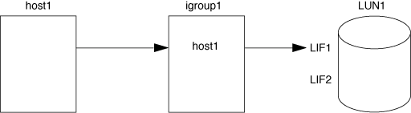
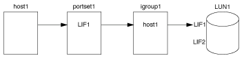

= Ways to limit LUN access with port sets and igroups
:icons: font
:imagesdir: ../media/

[.lead]
In addition to using Selective LUN Map (SLM), you can limit access to your LUNs through igroups and port sets.

Port sets can be used with SLM to further restrict access of certain targets to certain initiators. When using SLM with port sets, LUNs will be accessible on the set of LIFs in the port set on the node that owns the LUN and on that node's HA partner.

In the following example, initiator1 does not have a port set. Without a port set, initiator1 can access LUN1 through both LIF1 and LIF2.

You can limit access to LUN1 by using a port set. In the following example, initiator1 can access LUN1 only through LIF1. However, initiator1 cannot access LUN1 through LIF2 because LIF2 is not in port set1.

.Related information

* xref:selective-lun-map-concept.adoc[Selective LUN Map]

* xref:create-port-sets-binding-igroups-task.adoc[Create port sets and binding igroups to port sets]