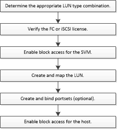

= LUN setup workflow
:icons: font
:imagesdir: ../media/

[.lead]
To set up your LUN, you must determine the best LUN type for your needs. Then you can follow a series of tasks to verify your protocol license, enable block access, create and map your LUN, and enable block access on your host. You can also optionally create and bind portsets as part of the LUN setup workflow.

//2021-12-21, BURT 1418089