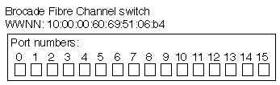

= SAN provisioning with FC
:icons: font
:imagesdir: ../media/

[.lead]
You should be aware of the important concepts that are required to understand how ONTAP implements an FC SAN.

== How FC target nodes connect to the network
Storage systems and hosts have adapters so that they can be connected to FC switches with cables.

When a node is connected to the FC SAN, each SVM registers the World Wide Port Name (WWPN) of its LIF with the switch Fabric Name Service. The WWNN of the SVM and the WWPN of each LIF is automatically assigned by ONTAP..

[NOTE]
====
Direct-connection to nodes from hosts with FC is not supported, NPIV is required and this requires a switch to be used.With iSCSI sessions, communication works with connections that are either network routed or direct-connect. However, both of these methods are supported with ONTAP.

====

== How FC nodes are identified

Each SVM configured with FC is identified by a worldwide node name (WWNN).

== How WWPNs are used

WWPNs identify each LIF in an SVM configured to support FC. These LIFs utilize the physical FC ports in each node in the cluster, which can be FC target cards, UTA or UTA2 configured as FC or FCoE in the nodes.

* Creating an initiator group
+
The WWPNs of the host's HBAs are used to create an initiator group (igroup). An igroup is used to control host access to specific LUNs. You can create an igroup by specifying a collection of WWPNs of initiators in an FC network. When you map a LUN on a storage system to an igroup, you can grant all the initiators in that group access to that LUN. If a host's WWPN is not in an igroup that is mapped to a LUN, that host does not have access to the LUN. This means that the LUNs do not appear as disks on that host.
+
You can also create port sets to make a LUN visible only on specific target ports. A port set consists of a group of FC target ports. You can bind an igroup to a port set. Any host in the igroup can access the LUNs only by connecting to the target ports in the port set.

* Uniquely identifying FC LIFs
+
WWPNs uniquely identify each FC logical interface. The host operating system uses the combination of the WWNN and WWPN to identify SVMs and FC LIFs. Some operating systems require persistent binding to ensure that the LUN appears at the same target ID on the host.

== How worldwide name assignments work

Worldwide names are created sequentially in ONTAP. However, because of the way ONTAP assigns them, they might appear to be assigned in a non-sequential order.

Each adapter has a pre-configured WWPN and WWNN, but ONTAP does not use these pre-configured values. Instead, ONTAP assigns its own WWPNs or WWNNs, based on the MAC addresses of the onboard Ethernet ports.

The worldwide names might appear to be non-sequential when assigned for the following reasons:

* Worldwide names are assigned across all the nodes and storage virtual machines (SVMs) in the cluster.
* Freed worldwide names are recycled and added back to the pool of available names.

== How FC switches are identified

Fibre Channel switches have one worldwide node name (WWNN) for the device itself, and one worldwide port name (WWPN) for each of its ports.

For example, the following diagram shows how the WWPNs are assigned to each of the ports on a 16-port Brocade switch. For details about how the ports are numbered for a particular switch, see the vendor-supplied documentation for that switch.

Port  *0*, WWPN 20:**00**:00:60:69:51:06:b4

Port  *1*, WWPN 20:**01**:00:60:69:51:06:b4

Port *14*, WWPN 20:**0e**:00:60:69:51:06:b4

Port *15*, WWPN 20:**0f**:00:60:69:51:06:b4

// 2023, Nov 09, Jira 1466
