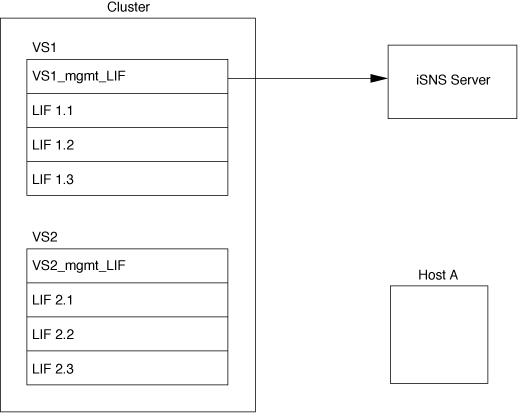
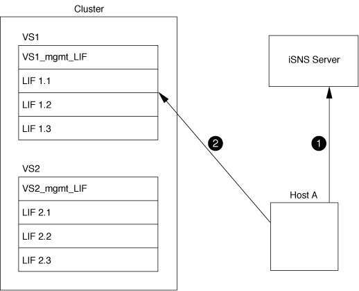

= How SVMs interact with an iSNS server
:icons: font
:imagesdir: ../media/

[.lead]
The iSNS server communicates with each storage virtual machine (SVM) through the SVM management LIF. The management LIF registers all iSCSI target node name, alias, and portal information with the iSNS service for a specific SVM.

In the following example, SVM VS1 uses the SVM management LIF vs1_mgmt_lif to register with the iSNS server. During iSNS registration, an SVM sends all the iSCSI LIFs through the SVM management LIF to the iSNS Server. After the iSNS registration is complete, the iSNS server has a list of all the LIFs serving iSCSI in VS1. If a cluster contains multiple SVMs, each SVM must register individually with the iSNS server to use the iSNS service.

In the next example, after the iSNS server completes the registration with the target, Host A can discover all the LIFs for VS1 through the iSNS server as indicated in step 1. After Host A completes the discovery of the LIFs for VS1, Host A can establish a connection with any of the LIFs in VS1 as shown in step 2. Host A is not aware of any of the LIFs in VS2 until the management LIF VS2_mgmt_LIF for VS2 registers with the iSNS server.

However, if you define the interface access lists, the host can only use the defined LIFs in the interface access list to access the target.

After iSNS is initially configured, ONTAP automatically updates the iSNS server when the SVM configuration settings change.

A delay of a few minutes can occur between the time you make the configuration changes and when ONTAP sends the update to the iSNS server. Force an immediate update of the iSNS information on the iSNS server: `vserver iscsi isns update`
