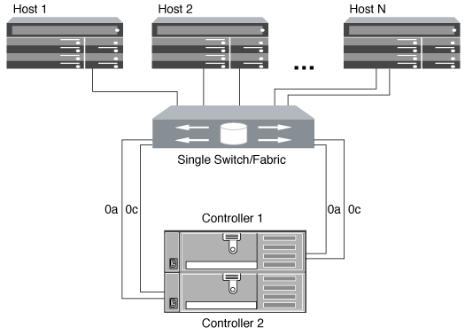
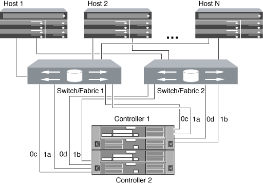

= Ways to configure FC & FC-NVMe SAN hosts with HA pairs
:icons: font
:imagesdir: ../media/

[.lead]
You can configure FC and FC-NVMe SAN hosts to connect to HA pairs through one or more fabrics. You cannot directly attach FC or FC-NVMe SAN hosts to HA pairs without using a switch.

You can configure FC and FC-NVMe SAN hosts with single fabric HA pairs or with multifabric HA pairs. The FC target port numbers (0a, 0c, 0d, 1a, 1b) in the illustrations are examples. The actual port numbers vary depending on the model of your storage node and whether you are using expansion adapters.

== Single-fabric HA pairs

In single-fabric HA pair configurations, there is one fabric connecting both controllers in the HA pair to one or more hosts. Because the hosts and controllers are connected through a single switch, single-fabric HA pairs are not fully redundant.

All platforms that support FC configurations support single-fabric HA pair configurations.

== Multifabric HA pairs

In multifabric HA pairs, there are two or more switches connecting HA pairs to one or more hosts. For simplicity, the following multifabric HA pair figure shows only two fabrics, but you can have two or more fabrics in any multifabric configuration:

// 2023-12-07, ONTAPDOC-1007