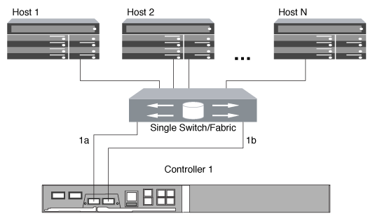

= Ways to configure FC and FC-NVMe SAN hosts with single nodes
:icons: font
:imagesdir: ../media/

[.lead]
You can configure FC and FC-NVMe SAN hosts with single nodes through one or more fabrics. N-Port ID Virtualization (NPIV) is required and must be enabled on all FC switches in the fabric. You cannot directly attach FC or FC-NMVE SAN hosts to single nodes without using an FC switch.

You can configure FC or FC-NVMe SAN hosts with single nodes through a single fabric or multifabrics. The FC target ports (0a, 0c, 0b, 0d) in the illustrations are examples. The actual port numbers vary depending on the model of your storage node and whether you are using expansion adapters.

== Single-fabric single-node configurations

In single-fabric single-node configurations, there is one switch connecting a single node to one or more hosts. Because there is a single switch, this configuration is not fully redundant. All hardware platforms that support FC and FC-NVMe support single-fabric single-node configurations. However, the FAS2240 platform requires the X1150A-R6 expansion adapter to support a single-fabric single-node configuration.

The following figure shows a FAS2240 single-fabric single-node configuration. It shows the storage controllers side by side, which is how they are mounted in the FAS2240-2. For the FAS2240-4, the controllers are mounted one above the other. There is no difference in the SAN configuration for the two models.

NOTE: FAS22xx systems are no longer supported.

== Multifabric single-node configurations

In multifabric single-node configurations, there are two or more switches connecting a single node to one or more hosts. For simplicity, the following figure shows a multifabric single-node configuration with only two fabrics, but you can have two or more fabrics in any multifabric configuration. In this figure, the storage controller is mounted in the top chassis and the bottom chassis can be empty or can have an IOMX module, as it does in this example.

image::../media/scrn_en_drw_fc-62xx-multi-singlecontroller.png[diagram of a multifabric single-node configuration]

.Related information

http://www.netapp.com/us/media/tr-4684.pdf[NetApp Technical Report 4684: Implementing and Configuring Modern SANs with NVMe/FC^]

// 2023-12-07, ONTAPDOC-1007