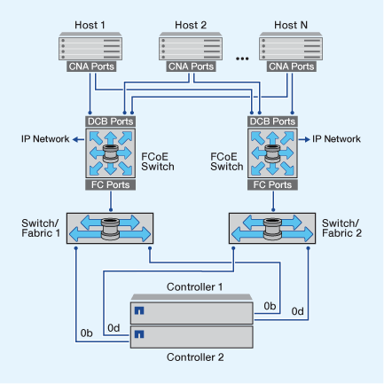
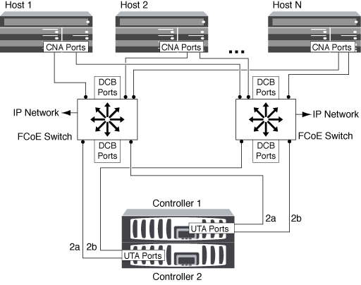
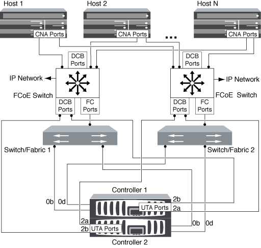
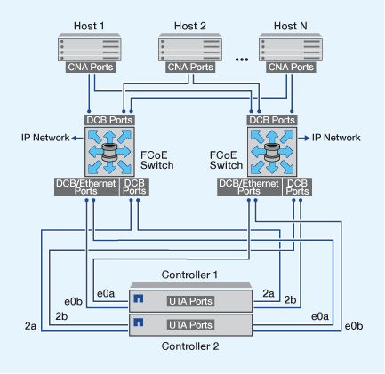

= Ways to Configure FCoE overview
:icons: font
:imagesdir: ../media/

[.lead]
FCoE can be configured in various ways using FCoE switches. Direct-attached configurations are not supported in FCoE.

All FCoE configurations are dual-fabric, fully redundant, and require host-side multipathing software. In all FCoE configurations, you can have multiple FCoE and FC switches in the path between the initiator and target, up to the maximum hop count limit. To connect switches to each other, the switches must run a firmware version that supports Ethernet ISLs. Each host in any FCoE configuration can be configured with a different operating system.

FCoE configurations require Ethernet switches that explicitly support FCoE features. FCoE configurations are validated through the same interoperability and quality assurance process as FC switches. Supported configurations are listed in the Interoperability Matrix. Some of the parameters included in these supported configurations are the switch model, the number of switches that can be deployed in a single fabric, and the supported switch firmware version.

The FC target expansion adapter port numbers in the illustrations are examples. The actual port numbers might vary, depending on the expansion slots in which the FCoE target expansion adapters are installed.

== FCoE initiator to FC target

Using FCoE initiators (CNAs), you can connect hosts to both controllers in an HA pair through FCoE switches to FC target ports. The FCoE switch must also have FC ports. The host FCoE initiator always connects to the FCoE switch. The FCoE switch can connect directly to the FC target or can connect to the FC target through FC switches.

The following illustration shows host CNAs connecting to an FCoE switch, and then to an FC switch before connecting to the HA pair:

== FCoE initiator to FCoE target

Using host FCoE initiators (CNAs), you can connect hosts to both controllers in an HA pair to FCoE target ports (also called UTAs or UTA2s) through FCoE switches.

== FCoE initiator to FCoE and FC targets

Using host FCoE initiators (CNAs), you can connect hosts to both controllers in an HA pair to FCoE and FC target ports (also called UTAs or UTA2s) through FCoE switches.

== FCoE mixed with IP storage protocols

Using host FCoE initiators (CNAs), you can connect hosts to both controllers in an HA pair to FCoE target ports (also called UTAs or UTA2s) through FCoE switches. FCoE ports cannot use traditional link aggregation to a single switch. Cisco switches support a special type of link aggregation (Virtual Port Channel) that does support FCoE. A Virtual Port Channel aggregates individual links to two switches. You can also use Virtual Port Channels for other Ethernet traffic. Ports used for traffic other than FCoE, including NFS, SMB, iSCSI, and other Ethernet traffic, can use regular Ethernet ports on the FCoE switches.

// 2023 Nov 09, ONTAPDOC 1466
// 4 Feb 2022, BURT 1451789 