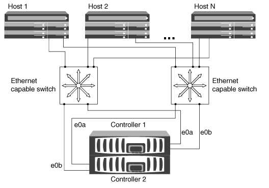
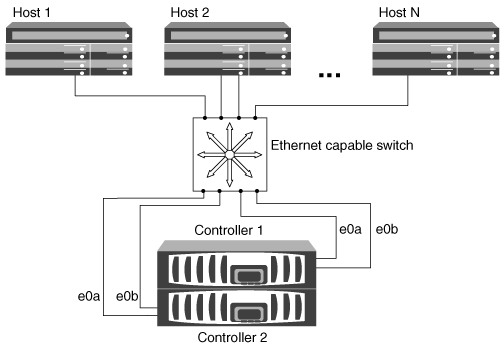
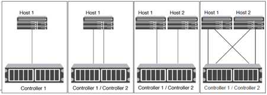

= Ways to configure iSCSI SAN hosts
:icons: font
:imagesdir: ../media/

[.lead]
You should set up your iSCSI configuration with high-availability (HA) pairs that attach directly to your iSCSI SAN hosts or that connect to your hosts through one or more IP switches.  

link:../concepts/high-availability-pairs-concept.html[HA pairs] are defined as the reporting nodes for the Active/Optimized and the Active/Unoptimized paths that will be used by the hosts to access the LUNs. Multiple hosts, using different operating systems, such as Windows, Linux, or UNIX, can access the storage at the same time.  Hosts require that a supported multipathing solution that supports ALUA be installed and configured. Supported operating systems and multipathing solutions can be verified on the link:https://mysupport.netapp.com/matrix[NetApp Interoperability Matrix Tool^].

In a multi-network configuration, there are two or more switches connecting the hosts to the storage system.  Multi-network configurations are recommended because they are fully redundant.  In a single-network configuration, there is one switch connecting the hosts to the storage system.  Single-network configurations are not fully redundant.  

[NOTE] 
====
link:../system-admin/single-node-clusters.html[Single-node configurations] are not recommended because they do not provide the redundancy needed to support fault tolerance and nondisruptive operations.
====

.Related links

* Learn how link:san-admin/selective-lun-map-concept.html#determine-whether-slm-is-enabled-on-a-lun-map[Selective LUN mapping (SLM)] limits the paths that are utilized to access the LUNs owned by an HA pair.
* Learn about link:../san-admin/manage-lifs-all-san-protocols-concept.html[SAN LIFs].
* Learn about the link:/benefits-vlans-iscsi-concept.html[benefits of VLANs in iSCSI].

== Multi-network iSCSI configurations

In multi-network HA pair configurations, two or more switches connect the HA pair to one or more hosts. Because there are multiple switches, this configuration is fully redundant.

== Single-network iSCSI configurations

In single-network HA pair configurations, one switch connects the HA pair to one or more hosts. Because there is a single switch, this configuration is not fully redundant.

== Direct-attachment iSCSI configuration 

In a direct-attached configuration, one or more hosts are directly connected to the controllers.

// 2024 Mar 26, Jira 1810
//2023 Nov 09, Jira 1466
