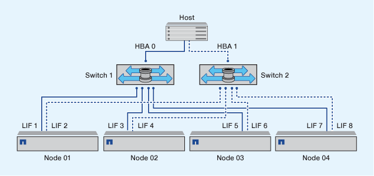

= Dual-fabric HA pair zoning
:icons: font
:imagesdir: ../media/

[.lead]
In dual-fabric configurations, you can connect each host initiator to each cluster node. Each host initiator uses a different switch to access the cluster nodes. Multipathing software is required on the host to manage multiple paths.

Dual-fabric configurations are considered high availability because access to data is maintained if a single component fails.

In the following figure, the host has two initiators and is running multipathing software. There are two zones. SLM is configured so that all nodes are considered as reporting nodes.

[NOTE]
====
The naming convention used in this figure is just a recommendation of one possible naming convention that you can choose to use for your ONTAP solution.
====

* Zone 1: HBA 0, LIF_1, LIF_3, LIF_5, and LIF_7
* Zone 2: HBA 1, LIF_2, LIF_4, LIF_6, and LIF_8

Each host initiator is zoned through a different switch. Zone 1 is accessed through Switch 1. Zone 2 is accessed through Switch 2.

Each initiator can access a LIF on every node. This enables the host to still access its LUNs if a node fails. SVMs have access to all iSCSI and FC LIFs on every node in a clustered solution based on the setting for Selective LUN Map (SLM) and the reporting node configuration. You can use SLM, portsets, or FC switch zoning to reduce the number of paths from an SVM to the host and the number of paths from an SVM to a LUN.

If the configuration included more nodes, the LIFs for the additional nodes would be included in these zones.

[NOTE]
====
The host operating system and multipathing software have to support the number of paths that is being used to access the LUNs on the nodes.
====

.Related information

https://hwu.netapp.com[NetApp Hardware Universe^]
