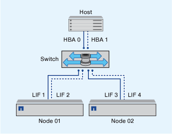

= Single-fabric zoning
:icons: font
:imagesdir: ../media/

[.lead]
In a single-fabric configuration, you can still connect each host initiator to each storage node. Multipathing software is required on the host to manage multiple paths. Each host should have two initiators for multipathing to provide resiliency in the solution.

Each initiator should have a minimum of one LIF from each node that the initiator can access. The zoning should allow at least one path from the host initiator to the HA pair of nodes in the cluster to provide a path for LUN connectivity. This means that each initiator on the host might only have one target LIF per node in its zone configuration. If there is a requirement for multipathing to the same node or multiple nodes in the cluster, then each node will have multiple LIFs per node in its zone configuration. This enables the host to still access its LUNs if a node fails or a volume containing the LUN is moved to a different node. This also requires the reporting nodes to be set appropriately.

Single-fabric configurations are supported, but are not considered highly available. The failure of a single component can cause loss of access to data.

In the following figure, the host has two initiators and is running multipathing software. There are two zones:

[NOTE]
====
The naming convention used in this figure is just a recommendation of one possible naming convention that you can choose to use for your ONTAP solution.
====

* Zone 1: HBA 0, LIF_1, and LIF_3
* Zone 2: HBA 1, LIF_2, and LIF_4

If the configuration included more nodes, the LIFs for the additional nodes would be included in these zones.

In this example, you could also have all four LIFs in each zone. In that case, the zones would be as follows:

* Zone 1: HBA 0, LIF_1, LIF_2, LIF_3, and LIF_4
* Zone 2: HBA 1, LIF_1, LIF_2, LIF_3, and LIF_4

[NOTE]
====
The host operating system and multipathing software have to support the number of supported paths that are being used to access the LUNs on the nodes. To determine the number of paths used to access the LUNs on nodes, see the SAN configuration limits section.
====

.Related information

https://hwu.netapp.com[NetApp Hardware Universe^]
