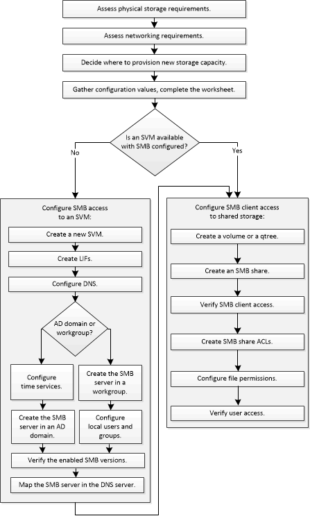

= SMB/CIFS configuration workflow
:icons: font
:imagesdir: ../media/

[.lead]
Configuring SMB involves assessing physical storage and networking requirements, and then choosing a workflow that is specific to your goal; configuring SMB access to a new or existing SVM, or adding a volume or qtree to an existing SVM that is already fully configured for SMB/CIFS access.

