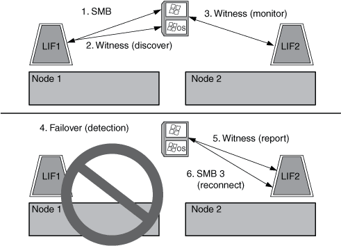

= How the Witness protocol works
:icons: font
:imagesdir: ../media/

[.lead]
ONTAP implements the Witness protocol by using a node's SFO partner as the witness. In the event of a failure, the partner quickly detects the failure and notifies the SMB client.

The Witness protocol provides enhanced failover using the following process:

. When the application server establishes a continuously available SMB connection to Node1, the CIFS server informs the application server that Witness is available.
. The application server requests the IP addresses of the Witness server from Node1 and receives a list of Node2 (the SFO partner) data LIF IP addresses assigned to the storage virtual machine (SVM).
. The application server chooses one of the IP addresses, creates a Witness connection to Node2, and registers to be notified if the continuously available connection on Node1 must move.
. If a failover event occurs on Node1, Witness facilitates failover events, but is not involved with giveback.
. Witness detects the failover event and notifies the application server through the Witness connection that the SMB connection must move to Node2.
. The application server moves the SMB session to Node2 and recovers the connection without interruption to client access.

// 2023 Nov 09, Jira 1466
