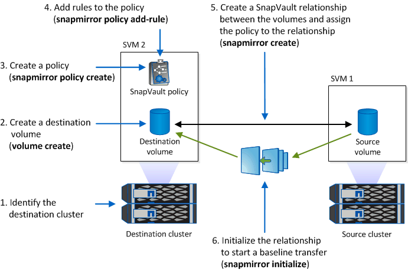

= Commit Snapshot copies to WORM on a vault destination
:icons: font
:imagesdir: ../media/

[.lead]
You can use SnapLock for SnapVault to WORM-protect Snapshot copies on secondary storage. You perform all of the basic SnapLock tasks on the vault destination. The destination volume is automatically mounted read-only, so there is no need to explicitly commit the Snapshot copies to WORM; therefore, creating scheduled Snapshot copies on the destination volume using SnapMirror policies is not supported.

.Before you begin

* If you want to use System Manager to configure the relationship, both the source and the destination clusters must be running ONTAP 9.15.1 or later.
* On the destination cluster:
** link:../system-admin/install-license-task.html[Install the SnapLock license]. 
** link:initialize-complianceclock-task.html[Initialize the Compliance Clock]. 
** If you are using an ONTAP release earlier than 9.10.1, link:create-snaplock-aggregate-task.html[create a SnapLock aggregate].
* The protection policy must be of type "vault".
* The source and destination aggregates must be 64-bit.
* The source volume cannot be a SnapLock volume.
* The source and destination volumes must be created in link:../peering/create-cluster-relationship-93-later-task.html[peered clusters] and link:../peering/create-intercluster-svm-peer-relationship-93-later-task.html[SVMs].

* If volume autogrow is disabled, the free space on the destination volume must be at least five percent more than the used space on the source volume.

.About this task

The source volume can use NetApp or non-NetApp storage. For non-NetApp storage, you must use FlexArray Virtualization.

NOTE: You cannot rename a Snapshot copy that is committed to the WORM state.

You can clone SnapLock volumes, but you cannot clone files on a SnapLock volume.

NOTE: LUNs are not supported in SnapLock volumes. LUNs are supported in SnapLock volumes only in scenarios where Snapshot copies created on a non-SnapLock volume are transferred to a SnapLock volume for protection as part of SnapLock vault relationship. LUNs are not supported in read/write SnapLock volumes. Tamperproof Snapshot copies however are supported on both SnapMirror source volumes and destination volumes that contain LUNs. 

Beginning with ONTAP 9.10.1, SnapLock and non-SnapLock volumes can exist on the same aggregate; therefore, you are no longer required to create a separate SnapLock aggregate if you are using ONTAP 9.10.1. You use the volume '-snaplock-type' option to specify a Compliance or Enterprise SnapLock volume type. In ONTAP releases earlier than ONTAP 9.10.1, the SnapLock mode, Compliance or Enterprise, is inherited from the aggregate. Version-flexible destination volumes are not supported. The language setting of the destination volume must match the language setting of the source volume.

A SnapLock volume that is a vault destination has a default retention period assigned to it. The value for this period is initially set to a minimum of 0 years for SnapLock Enterprise volumes and a maximum of 30 years for SnapLock Compliance volumes. Each NetApp Snapshot copy is committed with this default retention period at first. The retention period can be extended later, if needed. For more information, see xref:set-retention-period-task.adoc[Set retention time overview].

Beginning with ONTAP 9.14.1, you can specify retention periods for specific SnapMirror labels in the Snapmirror policy of the SnapMirror relationship so that the replicated Snapshot copies from the source to the destination volume are retained for the retention-period specified in the rule. If no retention period is specified, the default-retention-period of the destination volume is used.

Beginning with ONTAP 9.13.1, you can instantaneously restore a locked Snapshot copy on the destination SnapLock volume of a SnapLock vault relationship by creating a FlexClone with the `snaplock-type` option set to “non-snaplock” and specifying the Snapshot copy as the “parent-snapshot” when executing the volume clone creation operation. Learn more about link:../volumes/create-flexclone-task.html?q=volume+clone[creating a FlexClone volume with a SnapLock type].

For MetroCluster configurations, you should be aware of the following:

* You can create a SnapVault relationship only between sync-source SVMs, not between a sync-source SVM and a sync-destination SVM.
* You can create a SnapVault relationship from a volume on a sync-source SVM to a data-serving SVM.
* You can create a SnapVault relationship from a volume on a data-serving SVM to a DP volume on a sync-source SVM.

The following illustration shows the procedure for initializing a SnapLock vault relationship:

.Steps
You can use the ONTAP CLI to create a SnapLock vault relationship or, beginning with ONTAP 9.15.1, you can use System Manager to create a SnapLock vault relationship.

[role="tabbed-block"]
====
.System Manager
--
. Navigate to *Storage > Volumes* and select *Add*.
. In the *Add Volume* window, choose *More Options*.
. Enter the volume name, size, export policy and share name.
. Select *Lock destination snapshots to prevent deletion*, and in the *Locking method* section, choose *SnapLock for SnapVault*. This selection is not displayed if the policy type selected is not of type “vault”.
. If it is not already enabled, select *Initialize SnapLock Compliance Clock*.
. Save your changes.
--

--
.CLI
. On the destination cluster, create a SnapLock destination volume of type `DP` that is either the same or greater in size than the source volume:
+
[source,cli]
----
volume create -vserver <SVM_name> -volume <volume_name> -aggregate <aggregate_name> -snaplock-type <compliance|enterprise> -type DP -size <size>
----

+
The following command creates a 2GB SnapLock Compliance volume named `dstvolB` in `SVM2` on the aggregate `node01_aggr`:
+
----
cluster2::> volume create -vserver SVM2 -volume dstvolB -aggregate node01_aggr -snaplock-type compliance -type DP -size 2GB
----

. On the destination cluster, set the default retention period, as described in xref:set-default-retention-period-task.adoc[Set the default retention period].
+

. xref:../data-protection/create-replication-relationship-task.adoc[Create a new replication relationship] between the non-SnapLock source and the new SnapLock destination you created.
+
This example creates a new SnapMirror relationship with destination SnapLock volume `dstvolB` using a policy of `XDPDefault` to vault Snapshot copies labeled daily and weekly on an hourly schedule:
+
----
cluster2::> snapmirror create -source-path SVM1:srcvolA -destination-path SVM2:dstvolB -vserver SVM2 -policy XDPDefault -schedule hourly
----
+
[NOTE]

xref:../data-protection/create-custom-replication-policy-concept.adoc[Create a custom replication policy] or a xref:../data-protection/create-replication-job-schedule-task.adoc[custom schedule] if the available defaults are not suitable.
+

. On the destination SVM, initialize the SnapVault relationship created:
+
[source,cli]
----
snapmirror initialize -destination-path <destination_path>
----
+
The following command initializes the relationship between the source volume `srcvolA` on `SVM1` and the destination volume `dstvolB` on `SVM2`:
+
----
cluster2::> snapmirror initialize -destination-path SVM2:dstvolB
----

. After the relationship is initialized and idle, use the `snapshot show` command on the destination to verify verify the SnapLock expiry time applied to the replicated Snapshot copies.
+
This example lists the Snapshot copies on volume `dstvolB` that have the SnapMirror label and the SnapLock expiration date:
+
----
cluster2::> snapshot show -vserver SVM2 -volume dstvolB -fields snapmirror-label, snaplock-expiry-time
----
--
====

.Related information

https://docs.netapp.com/us-en/ontap-sm-classic/peering/index.html[Cluster and SVM peering]

https://docs.netapp.com/us-en/ontap-sm-classic/volume-backup-snapvault/index.html[Volume backup using SnapVault]

// 2024-April-16, IDR-340
// 2024-April-11, ONTAPDOC-1576
// 2024-Feb-21, ONTAPDOC-1366
// 2023-Oct-31, IDR-279
// 2023-Oct-31, ONTAPDOC-1230
// 2023-June-8, ONTAPDOC-1055
// 2023-Apr-17, ONTAP 9.13.1 update
// 2023-Feb-13, issue# 730
// 2021-11-10, BURT 1406421
// 2021-11-18, fix step numbering
// 2022-5-23, issue #505
// 2022-6-6, more updates for issue #505
