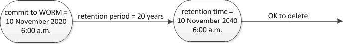

= Set the retention time
:icons: font
:imagesdir: ../media/

[.lead]
You can set the retention time for a file explicitly, or you can use the default retention period for the volume to derive the retention time. Unless you set the retention time explicitly, SnapLock uses the default retention period to calculate the retention time. You can also set file retention after an event.

.About retention period and retention time

The _retention period_ for a WORM file specifies the length of time the file must be retained after it is committed to the WORM state. The _retention time_ for a WORM file is the time after which the file no longer needs to be retained. A retention period of 20 years for a file committed to the WORM state on 10 November 2020 6:00 a.m., for example, would yield a retention time of 10 November 2040 6:00 a.m.

[NOTE]
====
Beginning with ONTAP 9.10.1, you can set a retention time up to October 26, 3058 and a retention period up to 100 years. When you extend retention dates, older policies are converted automatically. In ONTAP 9.9.1 and earlier releases, unless you set the default retention period to infinite, the maximum supported retention time is January 19 2071 (GMT).
====

.Important replication considerations

When establishing a SnapMirror relationship with a SnapLock source volume using a retention date later than January 19th 2071 (GMT), the destination cluster must be running ONTAP 9.10.1 or later or the SnapMirror transfer will fail.

.Important revert considerations

ONTAP prevents you from reverting a cluster from ONTAP 9.10.1 to an earlier ONTAP version when there are any files with a retention period later than “January 19, 2071 8:44:07 AM”.

.Understanding the default retention periods

A SnapLock Compliance or Enterprise volume has four retention periods:

* Minimum retention period (`min`), with a default of 0
* Maximum retention period (`max`), with a default of 30 years
* Default retention period, with a default equal to `min` for both Compliance mode and Enterprise mode beginning with ONTAP 9.10.1. In ONTAP releases earlier than ONTAP 9.10.1, the default retention period depends on the mode:
 ** For Compliance mode, the default is equal to `max`.
 ** For Enterprise mode, the default is equal to `min`.
* Unspecified retention period.
+
Beginning with ONTAP 9.8, you can set the retention period on files in a volume to `unspecified`, to enable the file to be retained until you set an absolute retention time. You can set a file with absolute retention time to unspecified retention and back to absolute retention as long as the new absolute retention time is later than the absolute time you previously set.
+
Beginning with ONTAP 9.12.1, WORM files with the retention period set to `unspecified` are guaranteed to have a retention period set to the minimum retention period configured for the SnapLock volume. When you change the file retention period from `unspecified` to an absolute retention time, the new retention time specified must be greater than the minimum retention time already set on the file.

So, if you do not set the retention time explicitly before committing a Compliance-mode file to the WORM state, and you do not modify the defaults, the file will be retained for 30 years. Similarly, if you do not set the retention time explicitly before committing an Enterprise-mode file to the WORM state, and you do not modify the defaults, the file will be retained for 0 years, or, effectively, not at all.

// 2022-06-16, issue #543
// 09 DEC 2021, BURT 1430515
// 27 OCT 2021, Jira IE-416

== Set the default retention period

You can use the `volume snaplock modify` command to set the default retention period for files on a SnapLock volume.

.What you'll need

The SnapLock volume must be online.

.About this task

The following table shows the possible values for the default retention period option:

[NOTE]
====
The default retention period must be greater than or equal to (>=) the minimum retention period and less than or equal to (\<=) the maximum retention period.
====

[options="header"]
|===
| Value| Unit| Notes
a|
0 - 65535
a|
seconds
a|

a|
0 - 24
a|
hours
a|

a|
0 - 365
a|
days
a|

a|
0 - 12
a|
months
a|

a|
0 - 100
a|
years
a|
Beginning with ONTAP 9.10.1. For earlier ONTAP releases, the value is 0 - 70.
a|
max
a|
-
a|
Use the maximum retention period.
a|
min
a|
-
a|
Use the minimum retention period.
a|
infinite
a|
-
a|
Retain the files forever.
a|
unspecified
a|
-
a|
Retain the files until an absolute retention period is set.
|===
The values and ranges for the maximum and minimum retention periods are identical, except for `max` and `min`, which are not applicable. For more information about this task, see link:set-retention-period-task.html[Set the retention time overview].

You can use the `volume snaplock show` command to view the retention period settings for the volume. For more information, see the man page for the command.

[NOTE]
====
After a file has been committed to the WORM state, you can extend but not shorten the retention period.
====

.Steps

. Set the default retention period for files on a SnapLock volume:
+
`*volume snaplock modify -vserver _SVM_name_ -volume _volume_name_ -default-retention-period _default_retention_period_ -minimum-retention-period _min_retention_period_ -maximum-retention-period _max_retention_period_*`
+
For a complete list of options, see the man page for the command.
+
[NOTE]
====
The following examples assume that the minimum and maximum retention periods have not been modified previously.
====
+
The following command sets the default retention period for a Compliance or Enterprise volume to 20 days:
+
----
cluster1::> volume snaplock modify -vserver vs1 -volume vol1 -default-retention-period 20days
----
+
The following command sets the default retention period for a Compliance volume to 70 years:
+
----
cluster1::> volume snaplock modify -vserver vs1 -volume vol1 -maximum-retention-period 70years
----
+
The following command sets the default retention period for an Enterprise volume to 10 years:
+
----
cluster1::> volume snaplock modify -vserver vs1 -volume vol1 -default-retention-period max -maximum-retention-period 10years
----
+
The following commands set the default retention period for an Enterprise volume to 10 days:
+
----
cluster1::> volume snaplock modify -vserver vs1 -volume vol1 -minimum-retention-period 10days
cluster1::> volume snaplock modify -vserver vs1 -volume vol1 -default-retention-period min
----
+
The following command sets the default retention period for a Compliance volume to infinite:
+
----
cluster1::> volume snaplock modify -vserver vs1 -volume vol1 -default-retention-period infinite -maximum-retention-period infinite
----

// 2022-7-22, issue 581 

== Set the retention time for a file explicitly

You can set the retention time for a file explicitly by modifying its last access time. You can use any suitable command or program over NFS or CIFS to modify the last access time.

.About this task

After a file has been committed to WORM, you can extend but not shorten the retention time. The retention time is stored in the `atime` field for the file.

[NOTE]
====
You cannot explicitly set the retention time of a file to `infinite`. That value is only available when you use the default retention period to calculate the retention time.
====

.Steps

. Use a suitable command or program to modify the last access time for the file whose retention time you want to set.
+
In a UNIX shell, use the following command to set a retention time of 21 November 2020 6:00 a.m. on a file named `document.txt`:
+
----
touch -a -t 202011210600 document.txt
----
+
[NOTE]
====
You can use any suitable command or program to modify the last access time in Windows.
====

== Set the file retention period after an event
:icons: font
:imagesdir: ../media/

Beginning with ONTAP 9.3, you can define how long a file is retained after an event occurs by using the SnapLock _Event Based Retention (EBR)_ feature.

.What you'll need

* You must be a SnapLock administrator to perform this task.
+
link:create-compliance-administrator-account-task.html[Create a SnapLock administrator account]

* You must have logged in on a secure connection (SSH, console, or ZAPI).

.About this task

The _event retention policy_ defines the retention period for the file after the event occurs. The policy can be applied to a single file or all the files in a directory.

* If a file is not a WORM file, it will be committed to the WORM state for the retention period defined in the policy.
* If a file is a WORM file or a WORM appendable file, its retention period will be extended by the retention period defined in the policy.

You can use a Compliance-mode or Enterprise-mode volume.

[NOTE]
====
EBR policies cannot be applied to files under a Legal Hold.
====

For advanced usage, see link:https://www.netapp.com/us/media/tr-4526.pdf[Compliant WORM Storage Using NetApp SnapLock].

|===
h|
*_Using EBR to extend the retention period of already existing WORM files_*

a|
EBR is convenient when you want to extend the retention period of already existing WORM files. For example, it might be your firm's policy to retain employee W-4 records in unmodified form for three years after the employee changes a withholding election. Another company policy might require that W-4 records be retained for five years after the employee is terminated.

In this situation, you could create an EBR policy with a five-year retention period. After the employee is terminated (the "`event`"), you would apply the EBR policy to the employee's W-4 record, causing its retention period to be extended. That will usually be easier than extending the retention period manually, particularly when a large number of files is involved.

|===

.Steps

. Create an EBR policy:
+
`*snaplock event-retention policy create -vserver _SVM_name_ -name _policy_name_ -retention-period _retention_period_*`
+
The following command creates the EBR policy `employee_exit` on `vs1` with a retention period of ten years:
+
----
cluster1::>snaplock event-retention policy create -vserver vs1 -name employee_exit -retention-period 10years
----

. Apply an EBR policy:
+
`*snaplock event-retention apply -vserver _SVM_name_ -name _policy_name_ -volume _volume_name_ -path _path_name_*`
+
The following command applies the EBR policy `employee_exit` on `vs1` to all the files in the directory `d1`:
+
----
cluster1::>snaplock event-retention apply -vserver vs1 -name employee_exit -volume vol1 -path /d1
----

// 2023 Nov 09, Jira 1466
// 09 DEC 2021, BURT 1430515
