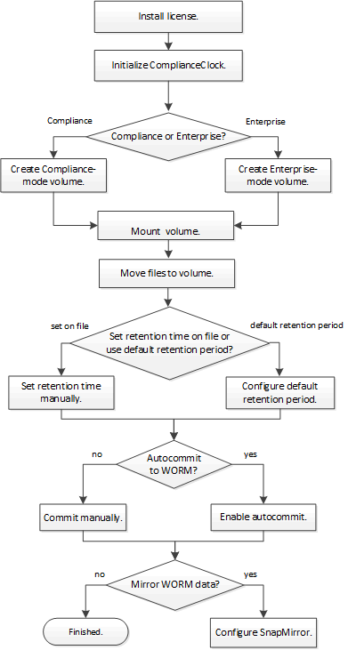

= SnapLock workflow
:icons: font
:imagesdir: ../media/

[.lead]
You specify which SnapLock mode you want to use, Compliance or Enterprise, when you create a SnapLock aggregate. The SnapLock volume you create inherits the setting. You typically use a file archiving application to move files from primary storage to the SnapLock volume.

