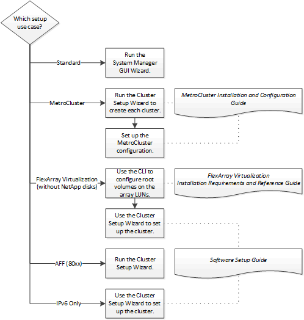

= Cluster setup workflows
:icons: font
:imagesdir: ../media/

[.lead]
After installing the hardware, you should use the System Manager GUI wizard whenever possible to set up the cluster. You should only use the CLI Cluster Setup wizard if the GUI wizard does not support the cluster setup (for example, a MetroCluster configuration or IPv6-only configuration).

*Related information*

https://docs.netapp.com/ontap-9/topic/com.netapp.doc.dot-mcc-inst-cnfg-fabric/home.html[Fabric-attached MetroCluster installation and configuration]

https://docs.netapp.com/ontap-9/topic/com.netapp.doc.dot-mcc-inst-cnfg-stretch/home.html[Stretch MetroCluster installation and configuration]

https://docs.netapp.com/ontap-9/topic/com.netapp.doc.vs-irrg/home.html[FlexArray virtualization installation requirements and reference]
